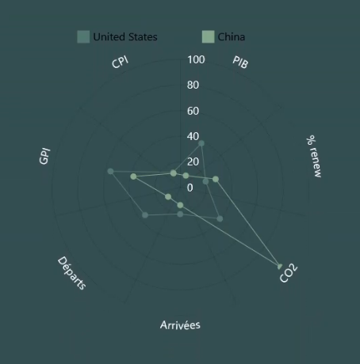

# Documentation des objets `Graphique`
Bonjour camarade ! Bienvenue dans cette documentation, qui vise à expliquer comment fonctionne les nouvelles classes créées pour mieux gérer les graphiques. Il sera détaillé le fonctionnement d'AMCharts, pourquoi j'ai choisi de passer sur une encapsulation personnalisée et donc comment se servir de ces nouveaux objets.

***DISCLAIMER:*** La lecture de cette documentation nécessite des connaissances de POO, acquises normalement l'an dernier. Il faut comprendre le mécanisme d'héritage notamment et l'effet qu'a la réécriture de méthodes. JavaScript utilise la même syntaxe que Java en terme de POO. Nous parlerons donc de constructeur, de `this` et de `super`. Néanmoins, JS n'est pas un langage objet à proprement parler, donc certains concepts et de la rigueur manquent.

## Comprendre AMCharts
Pour mieux appréhender le passage à ces classes spécifiques, il faut comprendre comment fonctionne AMCharts concrétement. Il est possible que vous ayez créé vos graphiques en recopiant les exemples de code sans réellement lire les instructions et les étapes de création. Nous allons revenir dessus.

Pour cela nous allons passer en revue deux codes simultanemment. L'un pour créer un Spider Plot, et l'autre un Line Chart, comme ceci : 




Même si vous avez compris le flow que suit la construction d'un graphique AMCharts, lisez ce qui suit, pour que vous puissiez remarquer les différences entre les deux figures.

### Initialisation

#### Line Chart
```js
root = am5.Root.new("line");

root.setThemes([
    am5themes_Animated.new(root)
]);

graph = root.container.children.push(am5xy.XYChart.new(root, {}))

cursor = graph.set("cursor", am5xy.XYCursor.new(root, {}));
cursor.lineY.set("visible", false);
```

#### Spider plot

```js
root = am5.Root.new("spider");

root.setThemes([
    am5themes_Animated.new(root)
]);

graph = root.container.children.push(am5radar.RadarChart.new(root, {}));

cursor = graph.set("cursor", am5radar.RadarCursor.new(root, {}));
cursor.lineY.set("visible", false);
```
Pour commencer, nous avons créé notre `root`, notre racine, qui est l'emplacement de notre graphique sur notre page, lié par l'ID que l'on veut (ici `spider` et `line`). C'est un espace d'abord vide que l'on alloue, que l'on va remplir avec nos objets et surtout notre graphique. Cette racine va nous accompagner tout du long de la création. 

Dans cette racine, on y ajoute un graphique, que l'on stocke dans la variable `graph`.

Enfin, on initialise le comportement de notre souris sur le graphique avec le `cursor`.

**On remarque que toutes les instructions sont les mêmes.** La différence est l'utilisation d'objets AMCharts : `am5xy.XYChart` vs `am5radar.RadarChart` pour la forme du graphique par exemple.

### Création des axes

#### Line chart

```js
xRenderer = am5xy.AxisRendererX.new(root, {});
xRenderer.labels.template.setAll({
    fill:"#FFFFFF"
});

xAxis = graph.xAxes.push(am5xy.CategoryAxis.new(root, {
    maxDeviation: 0,
    categoryField: "year",
    renderer: xRenderer,
    tooltip: am5.Tooltip.new(root, {})
}));
xAxis.data.setAll(data);


yRenderer = am5xy.AxisRendererY.new(root, {});
yRenderer.labels.template.setAll({
    fill:"#FFFFFF"
});

yAxis = graph.yAxes.push(am5xy.ValueAxis.new(root, {
    renderer:yRenderer
}));
```

#### Spider plot

```js
xRenderer = am5radar.AxisRendererCircular.new(root, {});
xRenderer.labels.template.setAll({
    fill:"#FFFFFF"
});

xAxis = graph.xAxes.push(am5xy.CategoryAxis.new(root, {
    maxDeviation: 0,
    categoryField: "var",
    renderer: xRenderer,
    tooltip: am5.Tooltip.new(root, {})
}));
xAxis.data.setAll(data);


yRenderer = am5radar.AxisRendererRadial.new(root, {});
yRenderer.labels.template.setAll({
    fill:"#FFFFFF"
});

yAxis = graph.yAxes.push(am5xy.ValueAxis.new(root, {
    min:0,
    max:100,
    renderer: yRenderer
}));

```

Pour chaque axe, on doit créer un objet `Renderer`, qui permet de les mettre en forme. Ici, on veut simplement que le texte soit en blanc, mais beaucoup d'arguments existent.

Ensuite on créée les deux axes X et Y. AMCharts propose différentes classes pour définir différents types d'axes. 
- Nos axes X sont des `CategoryAxis` : nous devons lui donner à l'avance les valeurs qui figureront sur l'axe, et adaptera nos séries de données. L'argument donné en paramètre de `categoryField` est la variable qu'il regardera pour observer les valeurs à prendre.
- Nos axes Y sont des `ValueAxis` : l'axe va s'ajuster tout seul selon les valeurs des séries de données

Les `Tooltip` sont les encarts qui seront affichés quand notre curseur passe sur des valeurs. On veut qu'il apparaisse mais sans le personnaliser, donc on crée un objet vide.

**On remarque à nouveau que toutes les instructions sont presque les mêmes.** La différence est l'utilisation d'objets AMCharts pour les `Renderer` : `am5xy.AxisRendererX` et `am5xy.AxisRendererY` vs `am5radar.AxisRendererCircular` et `am5radar.AxisRendererRadial`. On a aussi précisé deux paramètres dans le spider plot pour fixer les valeurs de l'axe Y.

### Ajout des données

#### Line chart
```js
serie = graph.series.push(am5xy.LineSeries.new(root, {
    name: "France",
    xAxis: xAxis,
    yAxis: yAxis,
    valueYField: "value",
    categoryXField: "year",
    tooltip: am5.Tooltip.new(root, {
        labelText: "{name} : {valueY}"
    }),
    stroke:"#52796F",
    fill:"#52796F",
}));

serie.bullets.push(function() {
    var graphics = am5.Circle.new(root, {
        radius: 4,
        stroke: "#52796F",
        fill: "#52796F"
    });

    return am5.Bullet.new(root, {
        sprite: graphics
    });
});

serie.data.setAll(data);
```

#### Spider plot

```js
serie = graph.series.push(am5radar.RadarLineSeries.new(root, {
    name:"France",
    xAxis: xAxis,
    yAxis: yAxis,
    valueYField: "value",
    categoryXField: "var",
    tooltip:am5.Tooltip.new(root, {
        labelText:"{name} : {valueY}",
    }),
    stroke:"#52796F",
    fill:"#52796F",
}));

serie.bullets.push(function () {
    var graphics = am5.Circle.new(root, {
        radius: 4,
        stroke: "#52796F",
        fill: "#52796F"
    })

    return am5.Bullet.new(root, {
        sprite: graphics
    })
});

serie.data.setAll(data);
```

***ENCORE UNE FOIS*** **les deux codes sont identiques, à la différence des objets manipulés.** Vous voyez où est-ce qu'on veut en venir...

## Simplifier le code

Vous avez compris, sur ces deux graphiques les codes sont les mêmes. On pourrait se dire "oui mais ce sont deux graphiques avec des lignes, donc forcément c'est très similaire !". 

C'est vrai, mais si on prend un Bar Chart, ce sera exacement la même chose, car pour dire que l'on veut des barres à la place de lignes, il suffit de donner l'objet `am5xy.ColumnSeries` dans la création des séries de données, et de ne pas créer les `Bullets`.

Pour n'importe quel graphique, le processus est le même, seul les objets changent. A la rigueur, quelques paramètres peuvent différer mais c'est minime, car au final on veut que tous nos graphiques se ressemblent ! Il suffit donc de créer un corps de graphique commun, qui ne change jamais, auquel on greffe les objets que l'on veut selon la forme du graphique voulu, et des axes créés.

## L'interface `Graphique`

Ce corps sera la classe `Graphique`, que vous retrouverez dans le fichier [amTools.js](amTools.js). 

Elle se décompose en plusieurs méthodes, permettant d'avoir une construction des graphiques fluide et avec un semblant de personnalisation. Je ne vais pas détailler le fonctionnement de chaque méthode, vous devriez pouvoir les comprendre avec ce qui est rédigé au dessus !

**Cette classe est une pseudo-interface.** Elle ne sera jamais appelée pour créer les graphiques, elle sert seulement de classe mère pour créer les graphiques que l'on veut.

Les arguments *en italique* sont ceux qui doivent être affectés dans les classes filles, et jamais ailleurs.

### Attributs

- `root` : objet AMC qui gère la racine du graphique
- `graph` : objet AMC qui gère la figure en elle même
- `xAxis` : objet AMC qui gère l'axe X
- `yAxis` : objet AMC qui gère l'axe Y
- `legend` : objet AMC qui gère la légende
- `series` : liste de séries de données

### Le constructeur

```js
constructor(id, figObj, cursorObj) {
    this.root = am5.Root.new(id)
    this.graph = this.root.container.children.push(figObj.new(this.root, {}))
    this.xAxis = null
    this.yAxis = null
    this.legend = null
    this.series = []

    var cursor = this.graph.set("cursor", cursorObj.new(this.root, {}));
    cursor.lineY.set("visible", false);

    this.root.setThemes([
        am5themes_Animated.new(this.root)
    ]);
}
```
La méthode `constructor` instancie les objets `Graphique` (cf cours de Java). Elle crée la racine, le curseur et la figure.

Arguments : 
- `id` : id de l'élément HTML où le graphique va se placer
- *`figObj`* : objet AMC qui va être utilisé pour générer le graphique
- *`cursorObj`* : objet AMC qui va être utilisé pour générer le curseur

Retour :
- aucun

### newXRenderer

```js
newXRenderer(obj) {
    var xRenderer = obj.new(this.root, {
        cellStartLocation: 0.1,
        cellEndLocation: 0.9
    });
    xRenderer.labels.template.setAll({
        fill:"#FFFFFF",
    });
    return xRenderer
}
```
Cette méthode crée un `Renderer` pour l'axe X selon des paramètres prédéfinits.

Argument : 
- *`obj`* : l'objet AMC utilisé pour générer le `Renderer`. 

Retour : 
- Un objet du même type que `obj` est renvoyé.

### newYRenderer

```js
newYRenderer(obj) {
    var yRenderer = obj.new(this.root, {});
    yRenderer.labels.template.setAll({
        fill:"#FFFFFF"
    });
    return yRenderer
}
```

Pareil que `newXRenderer(obj)`, mais pour l'axe Y.

Argument : 
- *`obj`* : l'objet AMC utilisé pour générer le `Renderer`. 

Retour : 
- Un objet du même type que `obj` est renvoyé.

### initXAxis

```js
initXAxis(rendererObj, field, data) {
    var base = this
    this.xAxis = this.graph.xAxes.push(am5xy.CategoryAxis.new(base.root, {
        categoryField: field,
        renderer: base.newXRenderer(rendererObj),
        tooltip: am5.Tooltip.new(base.root, {})
    }));
    this.xAxis.data.setAll(data)
}
```

Initialise un axe X, de type `CategoryAxis`. Cette méthode va appeler `newXRenderer(obj)` pour créer le `Renderer` à la volée. 

Arguments :
- *`rendererObj`* : l'objet AMC utilisé pour générer le `Renderer` dans la méthode `newXRenderer(obj)`. 
- `field` : nom de la variable qui sera utilisée pour déterminer les valeurs de l'axe
- `data` : données qui affectent l'axe

Retour :
- aucun, mais l'axe est stocké dans l'attribut `xAxis`

***REMARQUE :* POURQUOI UTILISER `base` AU LIEU DE `this` ?**

A plusieurs reprises dans la classe, nous passerons par une variable tampon `base` qui stockera le contenu de `this` *(l'objet courant)*, car quand on effectue l'action `this.graph.xAxes.push()`, l'appel de `this` fera référence à `this.graph`. C'est une spécificité de JavaScript... Qui est embêtante.......

### initYAxis

```js
initYAxis(rendererObj) {
    var base = this
    this.yAxis = this.graph.yAxes.push(am5xy.ValueAxis.new(base.root, {
        renderer: base.newYRenderer(rendererObj)
    }));
}
```

Initialise un axe Y, de type `ValueAxis`. Cette méthode va appeler `newYRenderer(obj)` pour créer le `Renderer` à la volée. 

Arguments :
- *`rendererObj`* : l'objet AMC utilisé pour générer le `Renderer` dans la méthode `newYRenderer(obj)`. 

Retour :
- aucun, mais l'axe est stocké dans l'attribut `yAxis`

### addSerie
```js
addSerie(data, name, color, xField, yField, obj, labelText) {
    var base = this

    var serie = this.graph.series.push(obj.new(base.root, {
        name: name,
        xAxis: base.xAxis,
        yAxis: base.yAxis,
        valueYField: yField,
        categoryXField: xField,
        tooltip: am5.Tooltip.new(base.root, {
            labelText: labelText
        }),
        stroke:color,
        fill:color,
    }));        
    
    serie.data.setAll(data)

    if (this.legend != null) {
        this.legend.data.push(serie)
    }

    this.series.push(serie)

    return serie
}
```
Crée une nouvelle série de données et l'ajoute au graphique.

Arguments :
- `data` : les données à appliquer
- `name` : le nom de la série, utilisé ensuite dans la légende
- `color` : la couleur de la série sur notre figure
- `xField` : le nom de la variable qui prend l'axe X pour cette série
- `yField` : le nom de la variable qui prend l'axe Y pour cette série
- *`obj`* : objet AMC utilisé pour générer la série, change en fonction du type de graphique voulu
- `labelText` : texte qui sera affiché dans le `Tooltip` au survol des données

Retour :
- Un objet du même type que `obj` est renvoyé, représentant la série.

### addBullets

```js
addBullets(serie, color) {
    var base = this

    serie.bullets.push(function() {
        return am5.Bullet.new(base.root, {
            sprite: am5.Circle.new(base.root, {
                radius: 4,
                stroke: color,
                fill: color
            })
        });
    });
}
```

Ajoute des points sur le graphique à chaque valeur d'une série de données

Arguments :
- `serie` : la série de données concernée
- `color` : la couleur des points

Retour :
- aucun.

### addLegend
```js
addLegend() {
    this.legend = this.graph.children.push(
        am5.Legend.new(this.root, {
            centerX: am5.p50,
            x: am5.p50,
            fill:"#FFFFFF"
        })
    );
}
```
Ajoute une légende au graphique. Une fois la légende créée, les séries y seront ajoutées automatiquement.

Aucun argument et retour, la légende est stockée dans l'attribut `legend`.

***REMARQUE* : la légende doit donc être initialisée AVANT les séries de données pour fonctionner !**

## Une vraie classe : `Spider`

Maintenant que notre interface a été introduite, on va rentrer dans le vif avec la création d'une vraie classe pour afficher un Spider Plot.

### Le code

```js
class Spider extends Graphique {
    constructor(id) {
        super(id, am5radar.RadarChart, am5radar.RadarCursor)
    }
    initXAxis(field, data) {
        super.initXAxis(am5radar.AxisRendererCircular, field, data)
    }

    initYAxis() {
        var base = this
        this.yAxis = this.graph.yAxes.push(am5xy.ValueAxis.new(base.root, {
            min:0,
            max:100,
            renderer: base.newYRenderer(am5radar.AxisRendererRadial)
        }));
    }

    addSerie(data, name, color, xField, yField) {
        var serie = super.addSerie(data, name, color, xField, yField, am5radar.RadarLineSeries, "{name} : {valueY}")
        super.addBullets(serie, color)
        return serie
    }

}
```

### Explications

Pour chaque méthode qui nécessite un objet AMCharts, nous réécrivons une sous-méthode, afin de l'inclure dans les paramètres. Si aucune autre modification n'est nécessaire, l'appel de la méthode mère avec `super` suffit. Dès lors, pour créer un Spider Plot, il suffira de créer un objet Spider, et de donner les données que l'on veut, sans avoir à se soucier des noms et classes AMCharts.

La méthode `initYAxis` a été réécrite intégralement, pour y inclure les paramètres `min` et `max`.

L'appel de la méthode `addBullets()` se fait dans `addSerie()`, car nous voulons toujours avoir des points qui s'affichent sur notre Spider Plot. 

### Cas réel d'utilisation

```js
g = new Spider("spider")
g.initXAxis("var", data)
g.initYAxis()
g.addLegend()
g.addSerie(data, "Série 1", "#52796F", "var", "value")
g.addSerie(data, "Série 2", "#52796F", "var", "value2")
```

Et notre graphique fonctionne !

## Conclusion

J'espère que tout est compréhensible ! J'ai fait de mon mieux pour rédiger correctement ce document. Si des questions persistent, vous pouvez me contacter, et je modifierai le document pour le rendre plus simple ! 

Il y a beaucoup de code, mais c'est vraiment pour illustrer les propos !

Bon courage !