```{r setup, include=FALSE}
knitr::opts_chunk$set(echo = TRUE)
knitr::opts_chunk$set(tidy.opts=list(width.cutoff=20), format='markdown')
library(DBI)
library(RMySQL)
conn <- DBI::dbConnect(
  drv = RMySQL::MySQL(),    # database driver à utiliser
  host = "localhost",       # parfois: host = "localhost"
  port = 3306,              # le port s'affiche parfois dans l'URL de votre navigateur 
  username = "root",        # parfois: user = "root"
  password = "root",        # si pas de mot de passe. mettre: password = ""
  dbname = "ecotourisme",   # nom de votre base
)
```

# Introduction{.unnumbered}
Lorsque les vacances approchent, l’envie de quitter la routine quotidienne s'accompagne souvent de la recherche d'une destination idéale. Pour cette étape, plusieurs critères peuvent entrer en compte: le prix, évidemment, mais aussi le moyen de transport, l’hébergement, les activités ou encore l’empreinte carbone.\par
Le tourisme est une activité humaine qui a des impacts multiples et complexes sur l’environ-nement, l’économie et la société. Selon l’Organisation mondiale du tourisme (OMT), le tourisme international a atteint 1,4 milliard d’arrivées en 2018, soit une croissance de 6 % par rapport à l’année précédente. Cette tendance à la hausse devrait se poursuivre dans les prochaines années, avec une projection de 1,8 milliard d’arrivées en 2030.\par
En effet, face au changement climatique, de plus en plus de personnes souhaitent faire attention à impacter le moins possible l’environnement lors de leurs déplacements. Pendant longtemps, le tourisme a été appréhendé uniquement au niveau de ses retombées économiques. En 2018, la consommation touristique représentait 7,4 % du PIB en France, avec une croissance dynamique, portée principalement par les visiteurs étrangers.\par
Dans le même temps, le secteur engendre de nombreuses pressions sur l'environnement, et en particulier sur le climat. Selon l'ADEME (Agence De l'Environnement et de la Maîtrise de l'Energie), le tourisme génère actuellement 11 % des émissions de gaz à effet de serre en France. À l'heure où le monde ressent l'urgence de prendre des mesures significatives face aux défis environnementaux, le secteur du tourisme émerge comme l'un des contributeurs majeurs aux émissions de gaz à effet de serre.\par
Cependant, il n’existe pas de solution simple et universelle pour concilier tourisme et développement durable. Chaque destination présente des spécificités et des défis qui nécessitent une analyse approfondie et une adaptation permanente. C’est pourquoi nous avons créé Écotourisme, une plateforme en ligne innovante qui propose aux voyageurs une navigation personnalisée et responsable. Écotourisme se positionne comme la réponse à cette quête, prenant en compte une variété de critères, dont le prix, le moyen de transport, et surtout, l'empreinte carbone.\par
Écotourisme a été conçu pour répondre aux trois besoins principaux de nos utilisateurs: la réduction des dépenses, la simplification du processus de voyage, et la promotion de la responsabilité environnementale. Notre projet joue également un rôle de comparateur statistique. En effet, en collectant des données, nous présentons des statistiques couvrant de nombreuses années et divers indicateurs liés à l'économie, à l'écologie et au tourisme. À l'aide de graphiques et d'un score Écotourisme attribué à chaque pays, nos utilisateurs ont accès à des données globales, continentales et nationales. De plus, il est possible de comparer les données statistiques entre deux pays et choisir celui qui correspond le mieux à vos attentes et à vos valeurs. Que vous soyez un voyageur économe, un éco-voyageur engagé, ou simplement un passionné soucieux de minimiser son impact sur l'environnement, Écotourisme est votre solution.\par
Ce qui distingue fondamentalement notre plateforme est son approche intégrée. Contrairement à d'autres services qui se concentrent uniquement sur l'aspect économique ou environnemental, Écotourisme fusionne ces deux dimensions pour offrir une solution complète. Ce rapport a pour but de présenter notre projet Écotourisme, une plateforme qui propose aux voyageurs une offre personnalisée et responsable, basée sur des données statistiques et des critères économiques et environnementaux. 

# Sujet
Dans cette section du rapport, nous explorerons en détail la modélisation de notre projet à travers le cas d'utilisation en UML (Unified Modeling Language) et du Canvas, ainsi que la définition de nos besoins et exigences dans le cahier des charges. Ces outils puissants nous permettront de visualiser et de structurer les différents aspects de notre projet, offrant ainsi une compréhension approfondie de son architecture.\par
Notre projet aborde plusieurs besoins et problèmes clés auxquels sont confrontés les voyageurs d'aujourd'hui. En premier lieu, nous répondons à la quête d'économie des voyageurs en les aidant à réduire leurs dépenses, proposant ainsi une réponse adaptée au voyage économique. Simultanément, notre initiative s'engage en faveur de la responsabilité environnementale en encourageant des pratiques de voyage respectueuses de l'environnement. \par
De plus, notre solution vise à démystifier le processus de voyage en fournissant des informations claires et accessibles. En simplifiant les démarches, nous aspirons à rendre l'expérience de voyage plus transparente et moins intimidante pour nos utilisateurs.\par
Enfin, notre projet va au-delà de la simple utilité en encourageant activement le voyage: nous aspirons à inspirer les individus à explorer de nouveaux horizons tout en promouvant la préservation de notre planète. Ainsi, notre approche sert à la fois les intérêts des voyageurs en quête de simplicité et d'économie, tout en contribuant à la promotion de pratiques de voyage durables.\par
Aujourd'hui, plusieurs alternatives existent pour répondre aux besoins des voyageurs en quête d'économie et de responsabilité environnementale. Des plateformes de comparaison de voyages telles que Kayak ou Liligo se concentrent principalement sur l'aspect économique, offrant des options pour minimiser les coûts des déplacements. D'autre part, des sites comme l'ADEME, Carbon Footprint, et la Fondation Goodplanet permettent de calculer l'empreinte carbone associée aux voyages. \par
Cependant, notre approche se distingue en fusionnant ces deux aspects cruciaux du voyage. Notre plateforme offre une approche polyvalente en intégrant la comparaison économique et la mesure de l'empreinte carbone. En éliminant la nécessité pour les utilisateurs de consulter plusieurs sites simultanément, notre système simplifie le processus de planification du voyage, offrant ainsi une expérience complète pour ceux qui aspirent à voyager de manière économique et écologique. Notre différenciation réside dans la consolidation de ces fonctionnalités clés, offrant ainsi une réponse  intégrée et pratique pour les voyageurs soucieux de leur budget et de l'environnement. \par
Notre solution s'adresse à une diversité d'usagers partageant un intérêt commun pour des voyages économiques et respectueux de l'environnement. Nous ciblons un large éventail de personnes, sans distinction d'âge ou de besoins spécifiques. Les principaux usagers visés comprennent:

- **Les voyageurs économes:** Ceux qui cherchent des moyens efficaces de réduire leurs dépenses tout en profitant pleinement de leur expérience de voyage.
- **Les éco-voyageurs:** Les individus engagés dans des pratiques de voyage respectueuses de l'environnement, souhaitant minimiser leur impact écologique tout en explorant le monde.
- **Les étudiants et jeunes voyageurs:** Cette catégorie inclut les étudiants et les jeunes adultes à la recherche d'options de voyage abordables et informatives pour enrichir leur expérience.
- **Les curieux et passionnés:** Les personnes animées par la curiosité et la passion pour la découverte, cherchant des informations claires et inspirantes pour leurs voyages.

En ciblant ces différents profils, notre projet aspire à répondre aux attentes variées de notre public, créant ainsi une plateforme inclusive et accessible à tous les amateurs de voyages économiques et écologiques.

\vskip 1.0em

Les fonctionnalités clés de notre plateforme incluent la fourniture d'informations détaillées sur l'économie et l'écologie de chaque destination, permettant aux utilisateurs de prendre des décisions informées. De plus, notre système propose un calcul précis de l'empreinte carbone associée à chaque itinéraire, aidant ainsi les voyageurs à évaluer et à minimiser leur impact environnemental.
En plus de cela, notre plateforme offre une visibilité sur les coûts de voyage, facilitant la planification budgétaire des utilisateurs. Enfin, elle fournit des conseils pratiques pour des choix responsables tout au long du processus de planification et d'exécution du voyage. En résumé, notre solution vise à simplifier et à enrichir l'expérience de voyage en offrant une approche complète, favorisant des séjours économiques et respectueux de l'environnement.
Pour faciliter l'accès aux données, nous avons mis en place une carte interactive pour la sélection de la région du monde. En outre, nous intégrerons une barre de recherche munie d'un système d'autocorrection, permettant aux utilisateurs de trouver rapidement les informations dont ils ont besoin. Ces fonctionnalités visent à rendre l'expérience utilisateur fluide et intuitive, offrant un accès rapide et personnalisé aux données économiques et écologiques.
Pour constituer notre base de données, nous avons réalisé des recherches approfondies en nous appuyant sur des sources fiables telles que l'UNWTO, l'ONU, la Banque Mondiale, l'OCDE, et l'UE. Compte tenu de la diversité des domaines couverts par notre projet, nous avons croisé ces sources et comparé les données qu'elles fournissent, englobant des informations variées en économie, en écologie et dans le secteur du tourisme.
En outre, nous avons intégré des données non chiffrées, notamment des listes de pays, de villes, et des pays en conflit, que nous avons traitées de manière spécifique. La plupart de ces fichiers étaient au format xlsx, nécessitant un traitement à l'aide de Python. Cette approche méthodique garantit la fiabilité et la pertinence des informations fournies par notre plateforme, renforçant ainsi la qualité de l'expérience utilisateur.

A présent, nous allons nous intéresser à la modélisation pour mieux appréhender la complexité et la cohérence de notre initiative. 
Pour cela on va s’intéresser à un utilisateur. Il a deux possibilités, soit s’identifier ou se créer un compte ou alors aller sur le site de façon anonyme. Si l’utilisateur décide s’identifier,l’utilisateur aura la possibilité d'estimer son empreinte carbone ainsi que le coût d'un trajet depuis son domicile jusqu'à une destination spécifique. Cette fonctionnalité lui permettra d'obtenir rapidement une estimation des dépenses liées à son voyage tout en développant sa conscience environnementale. De plus, il peut mettre en favoris ses destinations favorite ou ses projets de voyage. Ainsi, grâce à la sauvegarde des informations, l’utilisateur peut garder son historique des calculs et des trajets mais aussi de ses favoris. 
Ensuite, un utilisateur connecter ou non peut lire les rapport d’analyse statistiques basé sur 
des aspects économique et/ou écologique. De plus en recherchant une région du monde ou en comparant différentes données (jusqu’à deux régions du monde différentes) il pourra visualiser des données en fonction de ces recherches pour pouvoir mieux s’informer ou mieux décider. 

<!--Dimensions: 1122 × 1238-->
<!--Ratio de 1.10-->
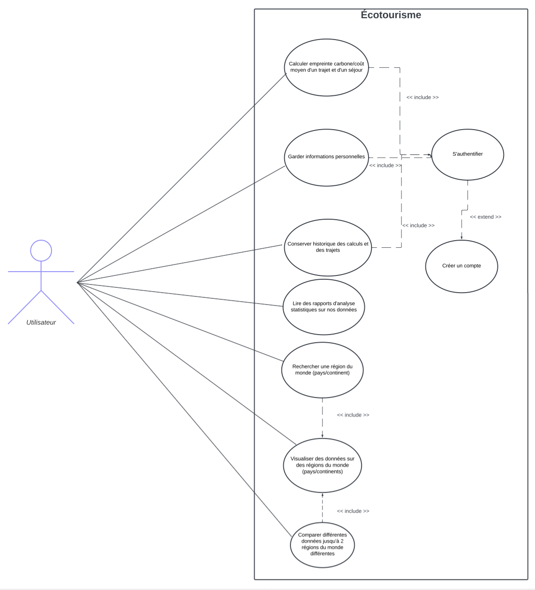{height="13.4cm" width="12cm"}

Pour conclure, lors de la conception et du développement de notre plateforme Écotourisme, certaines contraintes et limitations cruciales doivent être prises en compte pour garantir le succès du projet. Les principales contraintes comprennent:

- **Conformité aux normes de sécurité:** La plateforme devra respecter les normes de sécurité les plus strictes pour assurer la confidentialité des données des utilisateurs et garantir une expérience en ligne sécurisée.
- **Synchronisation des différentes avancées de chacun:** En raison de la collaboration entre les membres de l'équipe, il est impératif de maintenir une synchronisation constante des progrès réalisés par chacun. Des mécanismes de communication et de suivi seront mis en place pour assurer une collaboration efficace.
- **Intégration des idées individuelles:** Notre approche collaborative inclura l'intégration des idées individuelles de manière cohérente dans le développement de la plateforme. Chaque membre de l'équipe aura l'opportunité de contribuer de manière significative à la conception et à l'amélioration continue.
- **Adaptation aux emplois du temps de tous:** Compte tenu des contraintes d'emploi du temps de chaque membre de l'équipe, des mécanismes flexibles seront mis en place pour permettre une contribution optimale tout en respectant les engagements professionnels et personnels de chacun.
- **Résolution des problèmes techniques sur le site:** Tout problème technique sur la plateforme sera traité de manière rapide et efficace. Nous collaborons activement pour identifier l'origine du problème et le résoudre promptement.
Processus de conception et d'imagination du site: Le processus de conception et d'imagination du site sera continu et itératif. Les membres de l'équipe auront la possibilité de contribuer à l'évolution constante du site, favorisant ainsi la créativité et l'innovation.

Ces contraintes et limitations guideront notre équipe tout au long du projet, garantissant que notre plateforme Écotourisme répondra aux normes les plus élevées, tout en restant flexible et innovante dans sa conception et son développement.

# Base de données

## Introduction

Dans le cadre d'un projet nécessitant l'usage et la visualisation de données, le bon stockage de ces dernières est une étape primordiale dont repose la réussite du travail.
Cela comprend le choix des données, leur traitement, leur structuration jusqu'à enfin les requêtes qui sont effectuées dessus.
Il est nécessaire d'être méticuleux dans les définitions et les relations entre les tables, afin d'avoir une base de qualité et qui n'est pas confuse.

C'est une tâche d'autant plus complexe quand on traite d'un sujet multifacteur, et qui nécessite une quantité de données importantes: elles doivent concerner les plus de pays possible pour une analyse plus complète, sur une échelle de temps assez importante pour tirer des conclusions, et des statistiques différentes à mettre en perspective.

L'objectif principal était d'avoir des données liées à l'économie, au tourisme et à l'écologie.
Les limitations de chaque données se sont ensuite imposées à nous au fil de nos recherches.

## Provenance des données

La complexité de notre sujet a fait que nous avons dû nous baser sur des données traitant de thèmes différents (tourisme, écologie et économie), et provenant donc de diverses sources.
Toutes sont en accès libre sur Internet, exploitables, et proviennent pour la majeure partie d'organismes que nous jugeons fiables.
La plupart sont en format csv, mais certaines sous forme de tableau Excel, plus une dernière source qui est déjà en SQL.
Cela a nécessité un traitement spécifique pour tout uniformiser, qui sera détaillé dans la partie suivante.

-   **Source de données 1:**

    -   **Description:** Liste de tous les pays du monde avec informations générales.
    -   **Provenance:** Projet collaboratif très complet.
    -   **Format:** Fichier CSV.
    -   **Lien:** [\textcolor{blue}{Countries Database}](https://github.com/dr5hn/countries-states-cities-database/blob/master/csv/countries.csv)
    -   **Complément:** Noms de pays en français [Google Public Data](https://developers.google.com/public-data/docs/canonical/countries_csv?hl=fr)

-   **Source de données 2:**

    -   **Description:** Statistiques sur le tourisme mondial: arrivées, départs, recettes et dépenses par pays.
    -   **Provenance:** Données de l'UNWTO: l'organisation mondiale du tourisme, branche des Nations Unies.
    -   **Format:** Fichier Excel comprenant 12 feuilles.
    -   **Lien:** [\textcolor{blue}{UNWTO Tourism Statistics}](https://www.unwto.org/tourism-statistics/key-tourism-statistics)

-   **Source de données 3**

    -   **Description:** Statistiques économiques: PIB et PIB/hab.

    -   **Provenance:** Données de la Banque Mondiale.

    -   **Format:** Fichier CSV.

    -   **Lien:** [\textcolor{blue}{World Bank GDP Statistics}](https://databank.worldbank.org/reports.aspx?source=2&series=NY.GDP.MKTP.CD)

-   **Source de données 4**

    -   **Description:** Statistiques économiques: prix de consommation.

    -   **Provenance:** Données des Nations Unies.

    -   **Format:** Fichier CSV.

    -   **Lien:** [\textcolor{blue}{UN Consumer Price Index}](https://data.un.org/_Docs/SYB/CSV/SYB66_128_202310_Consumer%20Price%20Index.csv)

-   **Source de données 5**

    -   **Description:** Statistiques écologiques: émissions de CO2 et de gaz à effet de serre par pays.

    -   **Provenance:** Données de la Banque Mondiale.

    -   **Format:** Fichiers Excel.

    -   **Liens:** [\textcolor{blue}{CO2 Emissions}](https://data.worldbank.org/indicator/EN.ATM.CO2E.KT) et [\textcolor{blue}{GHG Emissions}](https://data.worldbank.org/indicator/EN.ATM.GHGT.KT.CE)

-   **Source de données 6**

    -   **Description:** Statistiques écologiques: part d'énergie renouvelable produite par pays.

    -   **Provenance:** Données de Ember, think tank indépendant.

    -   **Format:** Fichier CSV.

    -   **Lien:** [\textcolor{blue}{Renewable Energy Share}](https://ourworldindata.org/grapher/share-electricity-renewables?time=1986)

-   **Source de données 7**

    -   **Description:** Statistiques diverses: Global Peace Index par pays.

    -   **Provenance:** Données par Institute for Economics and Peace.

    -   **Format:** Fichier CSV.

    -   **Liens:** [\textcolor{blue}{Vision of Humanity}](https://www.visionofhumanity.org/maps/#/) et [\textcolor{blue}{Wikipedia - Global Peace Index}](https://en.wikipedia.org/wiki/Global_Peace_Index)

-   **Source de données 8**

    -   **Description:** Statistiques diverses: liste des pays en conflit.

    -   **Provenance:** Table HTML.

    -   **Lien:** [\textcolor{blue}{Countries Currently at War}](https://wisevoter.com/country-rankings/countries-currently-at-war/)

-   **Source de données 9**

    -   **Description:** Liste mondiale de villes.

    -   **Provenance:** Fichier CSV.

    -   **Lien:** [\textcolor{blue}{World Cities}](https://simplemaps.com/data/world-cities)

-   **Source de données 10**

    -   **Description:** Liste mondiale d'aéroports et routes aériennes.

    -   **Provenance:** Projet collaboratif, données SQL.

    -   **Lien:** [\textcolor{blue}{OpenFlights}](https://github.com/jpatokal/openflights)

## Traitements
Au vu de la quantité de sources que nous avons, réunir toutes les tables et données au sein d'une même structure a été un défi.
Par exemple, chaque fichier n'utilise pas forcément les mêmes identifiants pour définir un même pays: code ISO2, code ISO3 ou même le nom du pays directement.

ISO 3166-1 alpha-2 et ISO 3166-1 alpha-3 sont des normes internationales définissant respectivement des codes de deux et trois lettres pour la représentation normalisée des noms de pays.

De plus, une de nos sources de données est un fichier Excel formaté, où l'extraction manuelle est impossible.

Pour faire cela, nous avons écrit plusieurs scripts Python pour manipuler les fichiers Excel et CSV et injecter les données finales dans notre base.

-   **Source de données 1:**

Nous avons filtré le document pour ne conserver que les colonnes intéressantes: noms, codes ISO, coordonnées géographiques, drapeaux, continent.
Cela constitue le socle de nos tables.

Les noms ont été traduits en français avec la source complémentaire.
Les pays entre notre source initiale et le complément ont été réunis par le code ISO2.
Cette source étant incomplète, certains noms ont dû être repris manuellement.

Par la suite, nous avons supprimé certains pays qui ne figuraient dans aucun de nos jeux de données statistiques (détaillé dans les difficultés).

-   **Source de données 2:**

Le fichier Excel fourni par l'UNWTO est extrêmement formaté: chaque pays possède plusieurs lignes de stats, avec les années en colonnes, et un header contenant des informations sur plusieurs lignes.
Ce n'est absolument pas idéal pour traiter les informations, mais par chance un pattern ressort de ce fichier à travers chaque feuille, ce qui permet d'automatiser l'extraction facilement à l'aide de Python.

Ce traitement consiste à prendre les feuilles qui nous intéressent et à donner les intervalles de lignes entre les stats que l'on recherche, puis le programme génère un fichier CSV complet qui reproduit la feuille.
Ce CSV est ensuite retraité pour créer une nouvelle table, cette fois-ci en faisant passer les années dans les lignes.
Ce deuxième traitement permet aussi la fusion de plusieurs feuilles en mettant chaque statistique différente en colonnes.

Voici ces deux fonctions en Python:

```{python, tidy.opts=list(width.cutoff=60), tidy=TRUE}

def baseCsv(nameXlsx, nameSheet, nameCsv, maxRow, pad, plus, 
head, start, stop, pays, checkIso=False, checkNA=False, xls=False):
    """
    Cette fonction traite un fichier xlsx pour le transvaser en un 
    fichier CSV lisible. 
    Il est nécessaire que le fichier soit formatté de telle sorte que 
    chaque année soit en colonne, et chaque pays en ligne. 
    Elle nécessite beaucoup de paramètres à entrer à la main:
    - `nameXlsx`, `nameSheet`, `nameCsv`: nom du fichier XLSX, nom 
    de la feuille, et nom du CSV que l'on veut créer
    - `maxRow`, `pad`, `plus`, `head`: nombre de lignes dans le 
    fichier, écart entre chaque pays, écart entre le nom du pays et 
    les données, nombre de lignes d'en-tête à ignorer
    - `start` et `stop`: année de début et de fin des données
    - `pays`: nom de la colonne où est inséré le nom du pays
    - Paramètres optionnels: `checkIso` pour filtrer les 
    pays / `checkNA` pour retirer les valeurs nulles / `xls` si le 
    fichier est un .xls au lieu de .xlxs
    Le fichier Excel doit se trouver dans le répertoire data/xlsx, 
    et le CSV sera sauvegardé dans data/csv
    """

    with open(f"data/csv/{nameCsv}.csv", "w", 
    encoding="UTF-8") as file:
        ext = "xls" if xls else "xlsx"
        df = pd.read_excel(f"data/xlsx/{nameXlsx}.{ext}", 
            nameSheet, header=head)
        print(len(df))
        liste = [i for i in range(start, stop+1)]
        file.write("Pays;"+";".join(list(map(lambda x: str(x),
        liste)))+"\n")
        for row in range(0, maxRow, pad):
            string = str(df[pays][row])
            if checkIso and string not in isos:
                continue
            for col in liste:
                if not checkNA and df[col][row+plus] == "..":
                    string += ";NULL"
                elif checkNA and pd.isna(df[col][row+plus]):
                    string += ";NULL"
                else:
                    string += f";{df[col][row+plus]}"

            file.write(string+"\n")

    file.close()

```

```{python}
def agglomerate(tags,start,stop,maxRow):
    from copy import deepcopy

    allTable =[]
    for i in tags:
        allTable.append(deepcopy(readCSV(i)))

    final = []

    for i in range(start,stop+1):
        for j in range(maxRow):
            dictA = {"Pays":allTable[0][j]["Pays"],"Annee":i}
            for z, t in enumerate(allTable):
                dictA[tags[z]] = t[j][str(i)]
            final.append(dictA.copy())
    
    return final
```

Nous avons conservé les statistiques (depuis la feuille): arrivées touristiques totales (Indound Tourism-Arivals), arrivées depuis chaque région du monde (Inbound Tourism-Regions), arrivées pour raisons personnelles et professionnelles (Inbound Tourism-Purpose), départs touristiques totaux (Outbound Tourism-Departures), dépenses touristiques (Outbound Tourism-Expenditure), recettes touristiques (Inbound Tourism-Expenditure), moyen d'arrivée dans le pays (Indound Tourism-Transport) et enfin les emplois liés au tourisme (Employment)

Certains pays ont été supprimés, car ils ne figuraient pas dans notre liste de pays ou parce qu'ils ne présentaient pas assez de données.

Les noms des pays ont dû être remplacés par leur codes ISO2, afin de coller à la table principale

-   **Source de données 3:**

Suppression des données qui ne sont pas datées entre 1995 et 2021.

Remplacement des noms de pays par leur code ISO2.

-   **Source de données 4:**

Conservation des données qui sont sous l'intitulé "Consumer price index: General"

Remplacement des codes numériques des pays par leur code ISO2.

-   **Source de données 5:**

De la même manière que la source de donnée 1, nous avons deux tableaux Excel avec chaque pays en ligne et les années en colonne, mais moins formaté, et ne présentant qu'une statistique par pays.
Notre script python étant flexible, le processus de traitement pour rendre les données exploitables a été le même.

Suppression des données qui ne sont pas datées entre 1990 et 2020.

Remplacement des codes ISO3 des pays par leur code ISO2.

-   **Source de données 6:**

Remplacement des codes ISO3 des pays par leur code ISO2.

-   **Source de données 7:**

Traitement identique à la source de données 5.
Feuille choisie: Overall Scores.

Remplacement des codes ISO3 des pays par leur code ISO2.

-   **Source de données 8:**

La source ne fournit pas directement de fichier, mais seulement une table produite en HTML.
Nous avons copié collé cette table dans un fichier CSV, puis traduit les pays et types de conflits auxquels ils sont confrontés.

-   **Source de données 9:**

Tri des colonnes pour conserver le nom des villes (city), la latitude (lat), la longitude (lng), le code du pays (ISO2), si la ville est une capitale (capital), et la population de la ville (population).

Transformation de la colonne capital pour avoir des valeurs booléennes si la ville est une capitale ou non à la place de la valeur 'primary'.

Traitement des villes, pour faire le tri et ne garder que quelques villes par pays.

On garde la ou les capitales, puis entre 5 et 20 villes connues ou les plus peuplées par pays.

Simplification des caractères spéciaux pour les villes, pour éviter les erreurs de syntaxe.

Remplacement des virgules par des points pour les longitudes et latitudes.

-   **Source de données 10:**

Cette source est déjà sous format SQL.
Elle a été importée en dernier, une fois que notre base était bien constituée.
Nous avons importé les deux tables qui nous intéressaient pour notre base, les aéroports et les routes aériennes, puis les avons traitées par des requêtes SQL.

Filtrage des colonnes: id, noms et lieux des aéroports et aéroports d'arrivée et de départ des routes.

Remplacement des noms de pays par leur code ISO2 et remplacement des noms de villes par leur ID dans notre base.

Tri des aéroports pour ne garder que ceux des villes venant de la source de données 9, stockées dans une table nommée villes.

```{SQL}
DELETE FROM airports 
WHERE CONCAT(city,id_pays)
NOT IN (SELECT CONCAT(nom,id_pays) FROM villes);
```

Par conséquent, suppression de toutes les routes aériennes ayant pour aéroport d'arrivée ou de départ un aéroport qui a été supprimé.

```{SQL}
DELETE FROM routes 
WHERE dst_apid 
NOT IN (SELECT apid FROM airports) OR src_apid 
NOT IN (SELECT apid FROM airports); 
```

## Descriptif des tables

Une fois les données traitées, il faut les rendre prêtes à l'usage en choisissant la meilleure structure de stockage au sein de notre base de données.
Voici le descriptif des tables créées.

### Synthèse

| Nom        | Colonnes | Lignes | Clés étrangères   | N° source |
|------------|----------|--------|-------------------|-----------|
| pays       | 10       | 195    | continent, guerre | 1, 8      |
| tourisme   | 20       | 4780   | pays              | 2         |
| economie   | 7        | 5465   | pays              | 3, 4      |
| ecologie   | 6        | 6014   | pays              | 5, 6      |
| surete     | 4        | 2432   | pays              | 7         |
| villes     | 7        | 2277   | pays              | 9         |
| guerre     | 2        | 6      | /                 | 8         |
| continents | 2        | 6      | /                 | /         |
| airports   | 6        | 1260   | pays, ville       | 10        |
| routes     | 3        | 20556  | airports          | 10        |
| users      | 5        | N/A    | pays, ville       | /         |

### Description individuelle

-   **pays: données de la source 1, 195 lignes, 10 colonnes**

| Champ        | Type    | Description                                                         |
|------------------------|------------------------|------------------------|
| id           | VARCHAR | Clé primaire, code de chaque pays. Suit la norme ISO 3166-1 alpha-2 |
| lat          | DOUBLE  | Latitude géographique du pays                                       |
| lon          | DOUBLE  | Longitude géographique du pays                                      |
| nom          | VARCHAR | Nom complet du pays                                                 |
| iso_3        | VARCHAR | Code ISO 3166-1 alpha-3 du pays                                     |
| iso_alpha    | INT     | Code ISO 3166-1 numérique du pays                                   |
| emoji        | VARCHAR | Emoji drapeau associé au pays                                       |
| emojiU       | VARCHAR | Emoji drapeau associé au pays en caractères Unicode                 |
| id_guerre    | INT     | ID du statut de guerre du pays, clé étrangère de guerre             |
| id_continent | INT     | ID du continent du pays, clé étrangère de continents                |

-   **tourisme: données de la source 2, 4780 lignes, 20 colonnes**

| Champ         | Type    | Description                                                                               |
|------------------------|------------------------|------------------------|
| id            | INT     | Clé primaire, id numérique de la ligne.                                                   |
| id_pays       | VARCHAR | Code du pays concerné par la ligne, clé étrangère de pays                                 |
| annee         | INT     | Date des données                                                                          |
| arriveesTotal | INT     | Nombre total d'arrivées dans le pays sur l'année, en milliers                             |
| arriveesAF    | INT     | Nombre d'arrivées dans le pays venant d'Afrique sur l'année, en milliers                  |
| arriveesAM    | INT     | Nombre d'arrivées dans le pays venant d'Amérique sur l'année, en milliers                 |
| arriveesEA    | INT     | Nombre d'arrivées dans le pays venant d'Asie de l'Est sur l'année, en milliers            |
| arriveesEU    | INT     | Nombre d'arrivées dans le pays venant d'Europe sur l'année, en milliers                   |
| arriveesME    | INT     | Nombre d'arrivées dans le pays venant du Moyen Orient sur l'année, en milliers            |
| arriveesSA    | INT     | Nombre d'arrivées dans le pays venant d'Asie du Sud sur l'année, en milliers              |
| arriveesAutre | INT     | Nombre d'arrivées dans le pays venant d'ailleurs (non classifié) sur l'année, en milliers |
| arriveesPerso | INT     | Nombre d'arrivées dans le pays pour des raisons personnelles sur l'année, en milliers     |
| arriveesPro   | INT     | Nombre d'arrivées dans le pays pour des raisons professionnelles sur l'année, en milliers |
| arriveesAvion | INT     | Nombre d'arrivées dans le pays par voie aérienne sur l'année, en milliers                 |
| arriveesEau   | INT     | Nombre d'arrivées dans le pays par voie maritime sur l'année, en milliers                 |
| arriveesTerre | INT     | Nombre d'arrivées dans le pays par voie terrestre sur l'année, en milliers                |
| departs       | INT     | Nombre total de départs depuis le pays sur l'année, en milliers                           |
| depenses      | INT     | Argent dépensé lors des voyages de personnes parties du pays, en millions de US\$         |
| recettes      | INT     | Argent récolté lors des voyages de personnes venant dans le pays, en millions de US\$     |
| emploi        | INT     | Nombre d'emplois généré par le tourisme                                                   |

-   **economie: données des sources 3 et 4, 5465 lignes, 7 colonnes**

| Champ     | Type    | Description                                               |
|------------------------|------------------------|------------------------|
| id        | INT     | Clé primaire, id numérique de la ligne.                   |
| id_pays   | VARCHAR | Code du pays concerné par la ligne, clé étrangère de pays |
| annee     | INT     | Date des données                                          |
| cpi       | INT     | Indice des prix de consommation, en US\$                  |
| pib       | BIGINT  | Produit intérieur brut en US\$                            |
| pibParHab | BIGINT  | Produit intérieur brut par habitant en US\$               |

-   **ecologie: données des sources 5 et 6, 6014 lignes, 6 colonnes**

| Champ     | Type    | Description                                                     |
|------------------------|------------------------|------------------------|
| id        | INT     | Clé primaire, id numérique de la ligne.                         |
| id_pays   | VARCHAR | Code du pays concerné par la ligne, clé étrangère de pays       |
| annee     | INT     | Date des données                                                |
| co2       | DOUBLE  | Émissions de CO2 du pays                                        |
| ges       | DOUBLE  | Émissions de gaz à effet de serre du pays                       |
| elecRenew | DOUBLE  | \% d'électricité renouvelable produite dans le pays (1990-2015) |

-   **surete: données de la source 7, 2432 lignes, 4 colonnes**

| Champ   | Type    | Description                                               |
|------------------------|------------------------|------------------------|
| id      | INT     | Clé primaire, id numérique de la ligne.                   |
| id_pays | VARCHAR | Code du pays concerné par la ligne, clé étrangère de pays |
| annee   | INT     | Date des données                                          |
| cpi     | INT     | Indice de paix                                            |

-   **villes: données de la source 9, 2277 lignes, 7 colonnes**

| Champ      | Type    | Description                                               |
|------------------------|------------------------|------------------------|
| id         | INT     | Clé primaire, id numérique de la ligne.                   |
| nom        | VARCHAR | Nom de la ville                                           |
| lat        | DOUBLE  | Latitude géographique de la ville                         |
| lon        | DOUBLE  | Longitude géographique de la ville                        |
| id_pays    | VARCHAR | Code du pays concerné par la ligne, clé étrangère de pays |
| capitale   | BOOLEAN | Vrai si la ville est une capitale                         |
| population | INT     | Nombre d'habitant dans la ville                           |

-   **guerre: données de la source 8, 6 lignes, 2 colonnes**

| Champ  | Type    | Description                             |
|--------|---------|-----------------------------------------|
| id     | INT     | Clé primaire, id numérique de la ligne. |
| statut | VARCHAR | Intitulé du statut                      |

-   **continents: 6 lignes, 2 colonnes**

| Champ | Type    | Description                             |
|-------|---------|-----------------------------------------|
| id    | INT     | Clé primaire, id numérique de la ligne. |
| nom   | VARCHAR | Nom du continent                        |

-   **airports: données de la source 10, 1260 lignes, 6 colonnes**

| Champ    | Type    | Description                                                     |
|------------------------|------------------------|------------------------|
| id       | INT     | Clé primaire, id numérique de l'aéroport.                       |
| nom      | VARCHAR | Nom de l'aéroport                                               |
| id_ville | INT     | ID de la ville où se trouve l'aéroport, clé étrangère de villes |
| id_pays  | VARCHAR | ID du pays où se trouve l'aéroport, clé étrangère de pays       |
| lat      | DOUBLE  | Latitude géographique de la ville                               |
| lon      | DOUBLE  | Longitude géographique de la ville                              |

-   **routes: données de la source 10, 20556 lignes, 3 colonnes**

| Champ            | Type | Description                                                       |
|------------------------|------------------------|------------------------|
| id               | INT  | Clé primaire, id numérique de la route aérienne.                  |
| airportDepartID  | INT  | ID de l'aéroport de départ de la route, clé étrangère de airports |
| airportArriveeID | INT  | ID de l'aéroport d'arrivée de la route, clé étrangère de airports |

-   **users: table qui gère les utilisateurs de notre site, 5 colonnes**

| Champ    | Type    | Description                                                           |
|------------------------|------------------------|------------------------|
| id       | INT     | Clé primaire, id numérique de l'utilisateur                           |
| nom      | VARCHAR | Nom de l'utilisateur                                                  |
| id_ville | INT     | ID de la ville de résidence de l'utilisateur, clé étrangère de villes |
| id_pays  | VARCHAR | ID du pays de résidence de l'utilisateur, clé étrangère de pays       |
| mdp      | TEXT    | Mot de passe hashé de l'utilisateur                                   |

\newpage


## MCD / MOD

### MCD
<!--Dimensions: 586 × 1222-->
<!--Ratio: 0.48-->
{width="8cm" height="16.67cm"}

\newpage

### MOD
<!--Dimensions: 1139 × 697-->
<!--Ratio: 1.63-->
{width="12cm" height="7.36cm"}

\newpage


## Difficultés

Comme évoqué plus tôt dans le rapport, les difficultés principales lors de la création de notre base de données ont été de trouver les données adéquates provenant de sources sûres et de les associer.
Mais ce ne sont pas les seuls.

Une fois toutes nos données importées dans nos tables, nous avons fait face à un problème: chaque table ne contient pas les mêmes pays.
Il faut savoir que l'ONU reconnaît officiellement 197 États dans le monde.
Mais tous ne partagent pas leurs statistiques internes, ajoutées au fait que nos sources sont toutes différentes, et que certaines donnent une importance à des états semi-autonomes, il y a des disparités.
Un tri doit être fait !

Pour cela nous avons choisi une approche globale, et de regarder quels pays étaient présents dans chaque table.
Nous avons créé une table complémentaire, nommée checking:

-   **checking: 249 lignes, 7 colonnes**

| Champ    | Type    | Description                                        |
|----------|---------|----------------------------------------------------|
| id       | VARCHAR | Clé primaire, id du pays.                          |
| pays     | BOOLEAN | Vrai si le pays est présent dans la table pays     |
| tourisme | BOOLEAN | Vrai si le pays est présent dans la table tourisme |
| economie | BOOLEAN | Vrai si le pays est présent dans la table economie |
| ecologie | BOOLEAN | Vrai si le pays est présent dans la table ecologie |
| surete   | BOOLEAN | Vrai si le pays est présent dans la table surete   |
| villes   | BOOLEAN | Vrai si le pays est présent dans la table villes   |

Cette table est alimentée par un script Python, qui va regarder pour chacun des 249 pays listés dans notre carte intéractive s'il a au moins une occurrence dans les tables de statistiques.

```{Python}

def checking():
    global db
    cnx, cur = connectSQL(db)
    cur.execute("DROP TABLE IF EXISTS checking;")

    pays = ["AD","AE","AF","AG","AI","AL","AM","AO","AQ","AR","AS",
            "AT","AU","AW","AX","AZ","BA","BB","BD","BE","BF","BG",
            "BH","BI","BJ","BL","BM","BN","BO","BQ","BR","BS","BT",
            "BV","BW","BY","BZ","CA","CC","CD","CF","CG","CH","CI",
            "CK","CL","CM","CN","CO","CR","CU","CV","CW","CX","CY",
            "CZ","DE","DJ","DK","DM","DO","DZ","EC","EE","EG","EH",
            "ER","ES","ET","FI","FJ","FK","FM","FO","FR","GA","GB",
            "GD","GE","GF","GG","GH","GI","GL","GM","GN","GP","GQ",
            "GR","GS","GT","GU","GW","GY","HK","HM","HN","HR","HT",
            "HU","ID","IE","IL","IM","IN","IO","IQ","IR","IS","IT",
            "JE","JM","JO","JP","KE","KG","KH","KI","KM","KN","KP",
            "KR","KW","KY","KZ","LA","LB","LC","LI","LK","LR","LS",
            "LT","LU","LV","LY","MA","MC","MD","ME","MF","MG","MH",
            "MK","ML","MM","MN","MO","MP","MQ","MR","MS","MT","MU",
            "MV","MW","MX","MY","MZ","NA","NC","NE","NF","NG","NI",
            "NL","NO","NP","NR","NU","NZ","OM","PA","PE","PF","PG",
            "PH","PK","PL","PM","PN","PR","PS","PT","PW","PY","QA",
            "RE","RO","RS","RU","RW","SA","SB","SC","SD","SE","SG",
            "SH","SI","SJ","SK","SL","SM","SN","SO","SR","SS","ST",
            "SV","SX","SY","SZ","TC","TD","TF","TG","TH","TJ","TK",
            "TL","TM","TN","TO","TR","TT","TV","TW","TZ","UA","UG",
            "UM","US","UY","UZ","VA","VC","VE","VG","VI","VN","VU",
            "WF","WS","YE","YT","ZA","ZM","ZW"] 
    # pays listés sur AMCharts

    liste = []
    for i in pays:
        a = {"Code":i}
        
        if cur.execute(f"""SELECT DISTINCT id 
                       FROM pays 
                       WHERE id = '{i}'""").fetchone() != None:
            a["pays"] = True
        else:
            a["pays"] = False

        for j in ["tourisme","economie","ecologie","surete","villes"]:
            if cur.execute(f"""SELECT DISTINCT id_pays 
                         FROM {j} 
                         WHERE id_pays = '{i}'""").fetchone() != None:
                a[j] = True
            else:
                a[j] = False
        liste.append(a.copy())
    cur.execute("""
        CREATE TABLE IF NOT EXISTS checking (
            id VARCHAR(3) PRIMARY KEY,
            pays BOOLEAN,
            tourisme BOOLEAN,
            economie BOOLEAN,
            ecologie BOOLEAN,
            surete BOOLEAN,
            villes BOOLEAN
        )
    """)
    for i in liste:
        cur.execute(f"""
    INSERT INTO checking VALUES (
        '{i['Code']}',
        {i['pays']},
        {i['tourisme']},
        {i['economie']},
        {i['ecologie']},
        {i['surete']},
        {i['villes']}
    )
""")

    
    cnx.commit()
    
```

La lecture de cette table nous a permis de retirer 54 pays, qui n'étaient pas présents dans au moins une de ces tables: pays, tourisme, economie, ecologie.
Nous n'avons pas considéré surete car c'est une statistique complémentaire, qui n'est pas au coeur de notre sujet.
Pareil pour villes, qui est un bonus pour notre carte.
Cet autre script Python permet de supprimer de toutes nos tables de stats de pays donnés manuellement dans une liste:

```{Python}
def clearTables(liste):
    global db
    cnx, cur = connectSQL(db)

    tables = ["tourisme","surete","economie","ecologie","villes"]
    for i in liste:
        for j in tables:
            cur.execute(f"DELETE FROM {j} WHERE id_pays = '{i}'")
        cur.execute(f"DELETE FROM pays WHERE id = '{i}'")
    cnx.commit()
    
```

## Conclusion

Au moment où nous rédigeons cette partie de rapport, le mercredi 15 novembre, la base de données n'est pas encore finalisée.
Des finitions restent à réaliser, possiblement dans le tri des pays par exemple, ou même ajouter des statistiques qui nous manqueraient.

Sa création n'a pas été simple, mais permet déjà de donner un aperçu de la structure qu'aura notre site, et de ce qu'il proposera.

Trouver des données fiables et savoir les exploiter est une étape très importante du travail, qui conditionne toute la suite du projet.

Nous nous retrouvons donc avec 11 tables différentes, connectées entre elles par des clés étrangères.
Elles gravitent principalement autour de la table pays, et proviennent de sources diverses et complémentaires: ONU, Banque Mondiale, deux projets collaboratifs, etc... Au vue de la quantité de données, le traitement automatisé par Python et SQL nous a permis de gagner un temps incalculable, car les manœuvres manuelles pour filtrer et modifier les données ont été assez faibles.

La critique que l'on pourrait tout de même adresser à ces méthodes est la nécessité d'avoir un ordinateur (très) puissant pour effectuer les opérations en temps rapide, et sans risque de Timeout Error.

Chaque membre du projet sans exception a été impliqué dans le processus de création de la base de données.
Elle a surtout été vérifiée et validée plusieurs fois avant chaque publication sur GitHub.

# Maquettage
Le maquettage est une étape importante pour la création d’un site internet. Cela permet de modéliser les idées du groupe, et ainsi avoir une base solide et fiable lors de l’étape de la création du code. C’est aussi un moyen d’affirmer une identité visuelle qui nous suivra tout au long de notre projet. Il consiste à réaliser des schémas ou des prototypes de l’interface du site, en tenant compte des besoins des utilisateurs, des contraintes techniques et des objectifs du projet. Le maquettage permet de tester et de valider le design, l’ergonomie et la navigation du site avant de passer à la phase de développement.
Au fil de notre réflexion, de nouvelles idées et fonctionnalités globales ont émergé, dépassant le cadre de la maquette, et nécessitant des aménagements sur la base de données par exemple. Nous avons donc dû adapter la structure et les relations de la base de données en fonction des nouvelles fonctionnalités que nous voulions implémenter. Chaque membre a eu des idées bien précises sur comment articuler notre site, alors nous avons pu les partager, les modifier, et surtout les faire évoluer ensemble. Le but pour nous était de faire un site internet interactif, et facile d’accès. Et ainsi répondre efficacement aux problèmes imposés par notre cahier des charges.

\vskip 5em

<!--Dimensions: 1408 × 576-->
<!--Ratio:2.44-->
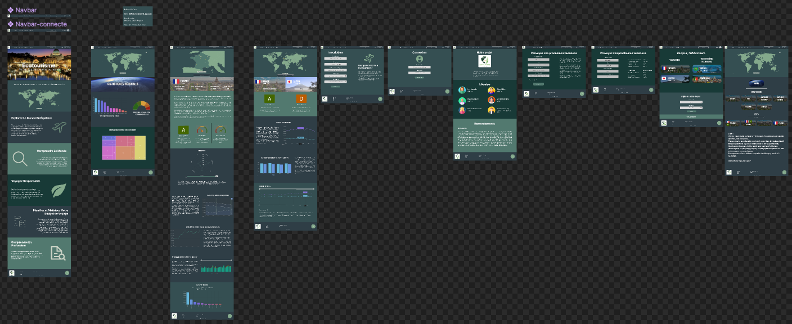{width="14cm" height="5.74cm"}

\newpage

## Page d'accueil
La page d’accueil possède un rôle à ne pas négliger. Même si elle ne contient pas de données ou d’analyse, elle se doit d’être simple et agréable pour convaincre l’utilisateur de poursuivre sa navigation. Nous avons donc pensé pour notre projet à une page élégante et informative. Elle utilise des couleurs sobres et harmonieuses, ainsi qu’une typographie claire et lisible. Elle dispose d’un menu de navigation qui permet d’accéder facilement aux différentes rubriques du site. Et affiche également le logo et le nom de notre site, qui reflètent notre identité visuelle et notre thématique.

Dès son arrivée, l’utilisateur retrouvera un carrousel de photos afin de captiver son attention. Ces photos sont choisies aléatoirement parmi les destinations les plus populaires, les plus insolites ou les plus méconnues du monde. 
L’utilisateur pourra explorer le monde via notre carte interactive, qui sera présente dans toutes les pages de statistiques de notre site internet. Ainsi il sera facile de découvrir des informations détaillées sur chaque destination en interagissant avec cette carte.

\vskip 2em

<!--Ratio: 0.97-->
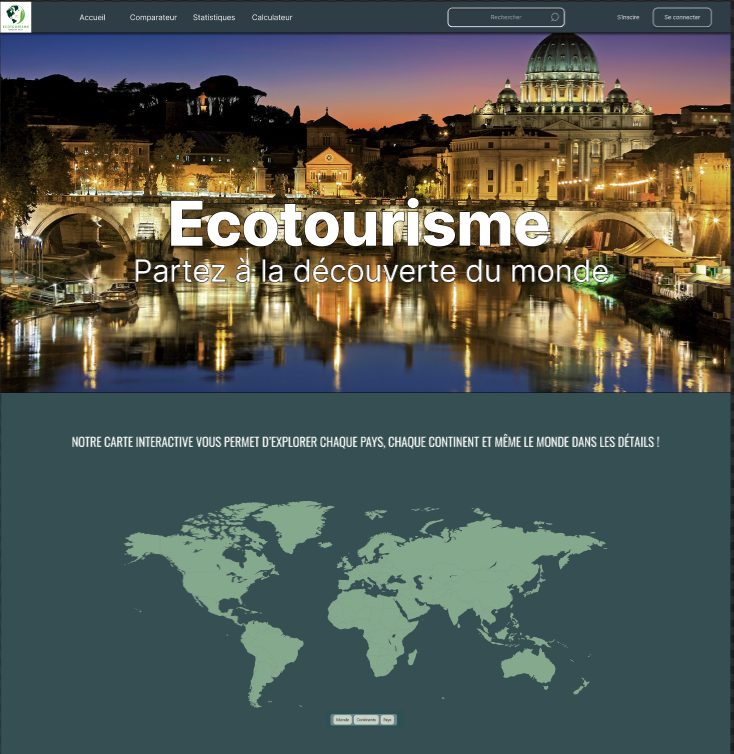{width="12cm" height="12.37cm"}

Finalement, la page d’accueil présente le but et le contenu de notre site, en donnant un aperçu des différentes rubriques du site, comme les statistiques, le calculateur etc. Ces descriptions permettront à l’utilisateur d’en savoir plus sur les valeurs que nous voulons défendre. Il pourra découvrir l’importance de voyager de manière responsable et apprendre à maîtriser son budget tout en contribuant à la préservation de la planète. 

<!--Ratio: 1.6-->
{width="12cm" height="7.5cm"}

\newpage

## Page Pays
La page pays est un élément central de notre site. Elle regroupe des données que nous avons décidé de présenter sous forme de graphiques. Cela permettra aux utilisateurs d’avoir une meilleure vision des statistiques importantes du pays.
Après que l’utilisateur ait sélectionné le pays qui l’intéresse sur la carte interactive, la page pays s’ouvre. Il pourra retrouver une carte avec les villes les plus visitées et/ou connues du pays concerné. Nous avons décidé de montrer les informations clés en créant un bandeau regroupant les différents indicateurs comme le taux de CO2, le PIB par habitant, etc. Il permettra aux utilisateurs d’avoir une vision globale du pays concerné sans avoir à parcourir toute la page.

<!--Dimensions:-->
<!--Ratio: 1.42-->
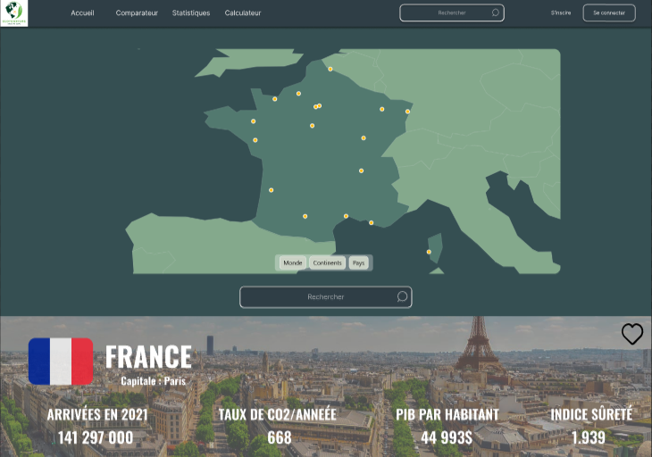{width="12cm" height="8.45cm"}

Par la suite, nous pouvons trouver une description du pays pour donner envie aux utilisateurs de voyager via des informations phares, comme les monuments importants, etc,... Un score écotourisme est attribué pour chaque pays, allant de la couleur verte (très bon score) à la couleur rouge (mauvais score). Ce score sera calculé à partir d'indicateurs économiques et écologiques spécifiques que nous détaillerons. Nous avons décidé d'attribuer une lettre et une couleur, afin de rendre ce score compréhensible et accessible à tous.

<!--Dimensions:-->
<!--Ratio: 1.19-->
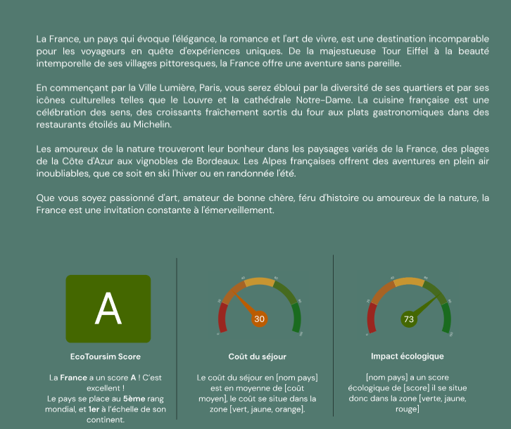{width="12cm" height="10.08cm"}

À travers cinq graphiques informatifs, l'utilisateur pourra explorer les tendances au fil des années, les arrivées touristiques par continent, l'évolution des émissions de CO2 et gaz à effet de serre, le lien entre le PIB et le tourisme, ainsi qu'un comparateur rapide. Par la suite, différents graphiques seront mis en place pour avoir une vision globale et plus claire des statistiques importantes.

<!--Dimensions:-->
<!--Ratio 0.88-->
{width="10cm" height="11.36cm"}

Le dernier graphique permettra d’avoir des pays à comparer avec le pays concerné, il suffira que l’utilisateur clique dessus pour voir apparaitre un comparateur complet entre les deux territoires.

<!--Dimensions:-->
<!--Ratio 1.68-->
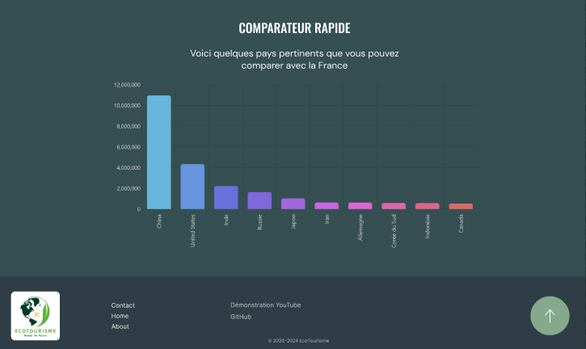{width="10cm" height="5.95cm"}

\newpage
## Page Monde
Cette autre page statistique offre une perspective mondiale permettant aux utilisateurs de s’informer sur les différents pays, et de choisir une destination en fonction de différents graphiques.
Nous mettons à disposition une carte interactive, qui permet de sélectionner un pays en particulier et d’accéder à ses données statistiques. 

Nous présentons également deux graphiques qui offrent une vision globale sur le monde. Le premier graphique montre le Top 10 des pays les plus visités, avec le nombre de visiteurs en millions. Le deuxième graphique montre la proportion de chaque score écotourisme attribué aux pays du monde, avec le pourcentage de pays ayant un score faible, moyen, ou élevé.
Le dernier graphique est plus complexe que les autres, car il croise plusieurs variables. Il s’agit d’un graphique, qui représente les arrivées totales touristiques, par pays et par continents. Le but de ce graphique est de montrer quel pays a été le plus attractif pour chaque continent, en tenant compte de la taille de la population et du score écotourisme.

<!--Ratio 0.82-->
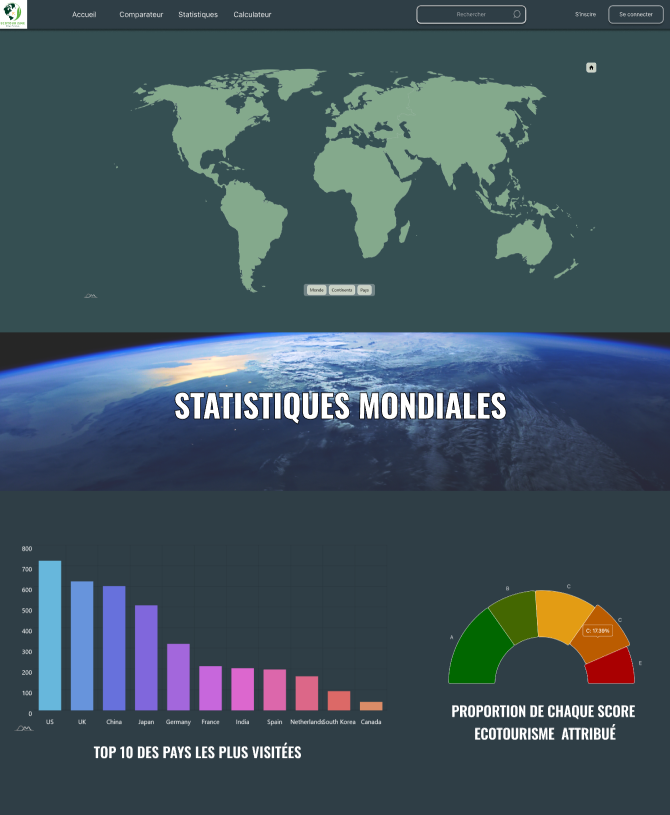{width="12cm" height="14.63cm"}

Le dernier graphique est plus complexe que les autres. On peut retrouver les arrivées totales touristiques, par pays et par continents. Le but étant de montrer quel pays a été le plus attractif pour le continent.

<!--Ratio 1.3-->
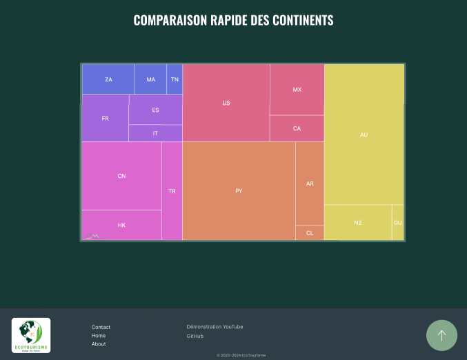{width="12cm" height="9.23cm"}

\newpage
## Page Comparateur
La page comparaison a pour objectif d’aider les utilisateurs à choisir entre deux pays qui pourraient les intéresser en fonction de leur caractéristiques mis en évidence par Ecotourisme.
Sur cette page, l’utilisateur aura encore à disposition une carte interactive, qui permet de sélectionner les deux pays qu’il veut comparer, et d’afficher les scores Ecotourisme attribués à chacun d’eux. 

<!--Ratio 0.91-->
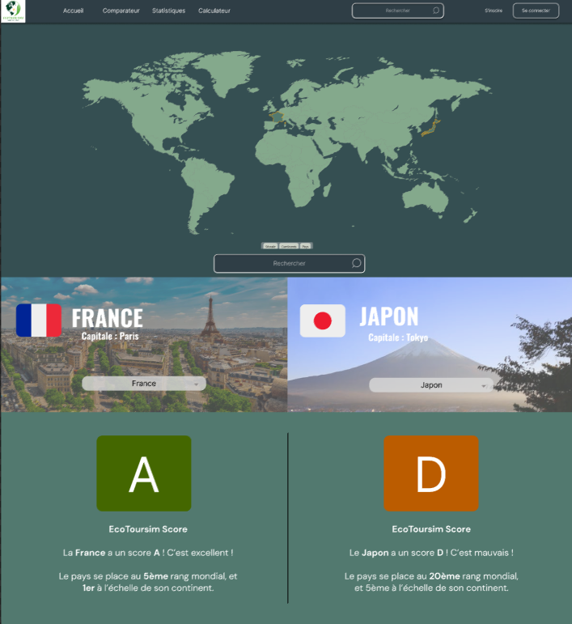{width="12cm" height="13.19cm"}

Nous présentons également des graphiques de comparaison, qui permettent de visualiser les différences entre les deux pays choisis sur des indicateurs statistiques pertinents. Nous comparons, dans le premier graphique, le produit intérieur brut (PIB) par habitant, qui mesure le niveau de richesse et de développement économique d’un pays. Le second graphique mets en évidence les émissions de dioxyde de carbone (CO2) de chacun des deux pays ce qui mesurent l’impact d’un pays sur le réchauffement climatique. Ces graphiques permettent à l’utilisateur d’avoir une vision plus globale des enjeux liés au voyage responsable.

Par la suite, nous pouvons retrouver des graphiques de comparaison, comme le PIB par habitant, et les émissions de CO2. L’utilisateur pourra donc avoir une vision plus globale des indicateurs statistiques des pays.

<!--Ratio 0.96-->
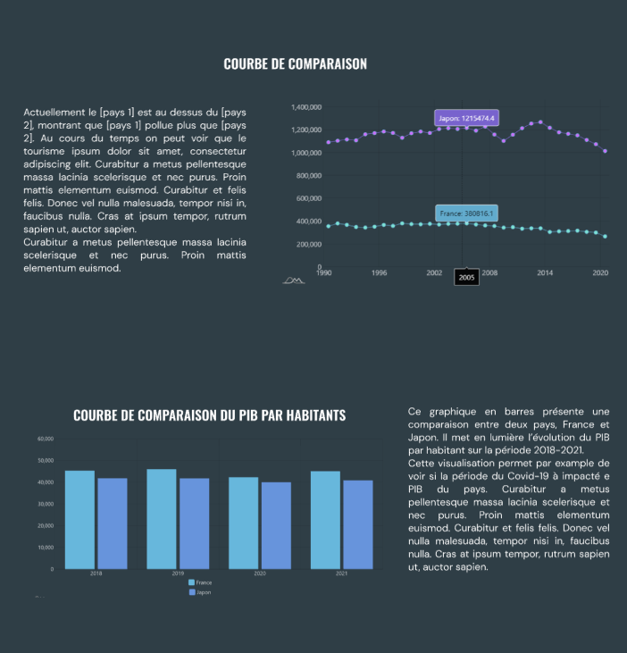{width="11cm" height="11.45cm"}

Pour finir, l’utilisateur pourra retrouver une comparaison de l’indice de sûreté de chaque pays, avec un “le saviez-vous” pour expliquer ce que représente cet indicateur.

<!--Ratio 1.32-->
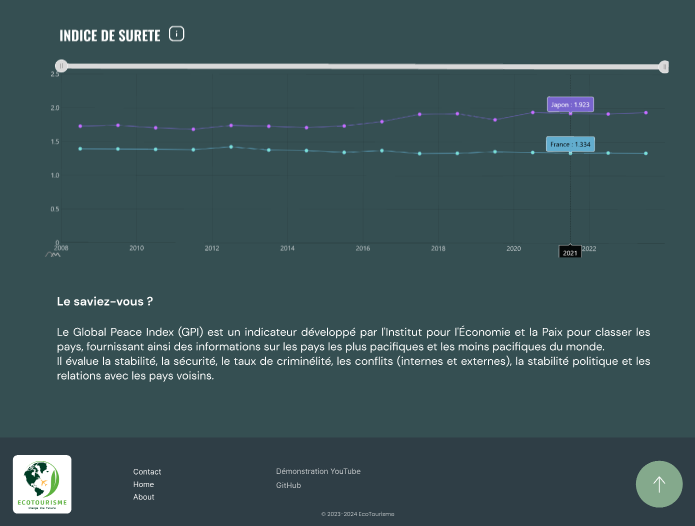{width="11cm" height="8.33cm"}

## Pages Inscription et Connexion
Le site web offre aux utilisateurs la possibilité de créer un compte personnel et de se connecter à leur espace privé. Lors de l’inscription, l’utilisateur renseigne un nom et un mot de passe pour son compte et doit indiquer son pays et sa ville d’origine, qui seront utilisés comme point de départ pour les calculs du service de calculateur.
Pour être accessible, les pages connexion et inscription sont facilement compréhensibles. Ce qui permettra à tous d’avoir accès aux pages supplémentaires.
Après avoir validé son inscription, l’utilisateur peut se connecter à son compte en entrant son identifiant et son mot de passe. Il sera alors redirigé vers une page profil, qui regroupe les informations relatives à son activité sur le site.

<!--Ratio 1.1-->
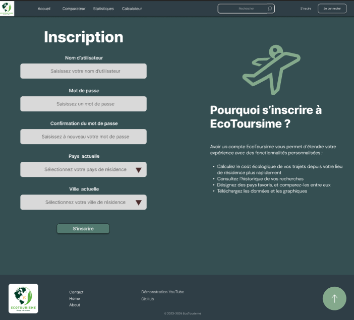{width="9cm" height="8.18cm"}

<!--Ratio 1.28-->
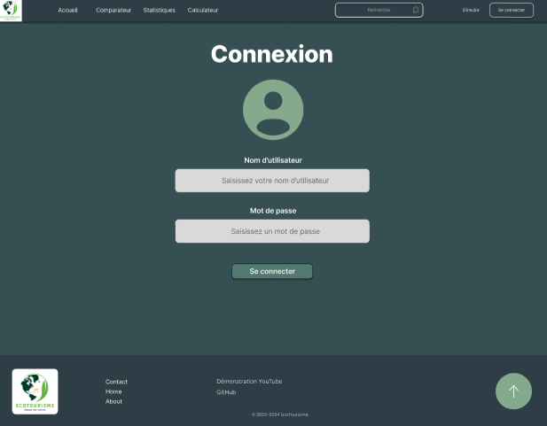{width="9cm" height="7.03cm"}

## Page Profil
La page profil a pour objectif de faciliter l’utilisation du site et de rendre le voyageur plus autonome et plus informé. Elle permet également de personnaliser le compte et de conserver les traces des recherches effectuées.

Sur cette page, un utilisateur connecté pourra consulter:

- **Ses dernières recherches effectuées:** il s’agit de l’historique des pays
qu’il a cherché.
- **Ses pays favoris:** il s’agit de la liste des pays qu’il a sélectionnés comme étant ses préférences de voyage.
- **Les paramètres du compte:** il s’agit des options qui lui permettent de personnaliser son compte et son expérience sur le site. Il pourra notamment modifier le pays et la ville qu’il a indiqués lors de l’inscription, s’il souhaite changer son point de départ pour les calculs du service de calculateur.
- **Et pourra se déconnecter:** il s’agit du bouton qui lui permet de se déconnecter de son compte et de quitter son espace privé. Il pourra ainsi protéger ses données personnelles et éviter que d’autres personnes accèdent à son compte sans son autorisation.

<!--Ratio 0.79-->
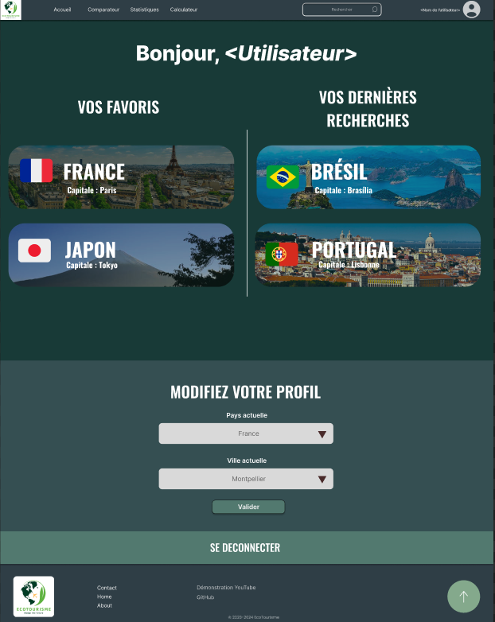{width="9cm" height="11.39cm"}

\newpage

## Page Calculateur

Le site web propose un service de calculateur pour les utilisateurs qui souhaitent voyager de manière responsable et économique. Pour accéder à ce service, l’utilisateur doit s’inscrire sur le site et se connecter à son compte. Une fois connecté, il peut accéder à la page calculateur, où il trouvera un formulaire à remplir. Le formulaire lui demande de saisir la ville et le pays de destination. Il lui demande également de choisir la durée de son séjour et le mode de transport qu’il préfère parmi trois options: l’avion, le train ou la voiture.
En fonction des informations fournies, le calculateur va estimer plusieurs éléments liés au voyage, tels que:

- **L’empreinte carbone:** il s’agit de la quantité de gaz à effet de serre émise par le voyageur et son mode de transport.
- **Le coût du trajet:** il s’agit du prix du billet ou du carburant pour se rendre à la destination.
- **Le coût du séjour:** il s’agit du budget nécessaire pour se loger, se nourrir et se divertir sur place. Le calculateur va se baser sur le coût de la vie moyen dans la destination et la durée du séjour pour estimer le coût total.
- **Les estimations supplémentaires:** il s’agit des données complémentaires qui peuvent être utiles pour le voyageur, comme l’aéroport le plus proche du départ, si le mode de transport choisi est l’avion, ou la distance et le temps de trajet, si le mode de transport choisi est le train ou la voiture. Le calculateur va calculer ces estimations en utilisant les données dans notre base de donnée.

Le calculateur a pour objectif de faciliter la planification du voyage et de sensibiliser le voyageur aux impacts environnementaux et économiques de son choix. Il permet également de comparer les avantages et les inconvénients de chaque mode de transport et de choisir le plus adapté à ses besoins et à ses envies.

<!--Ratio 1.21-->
<!--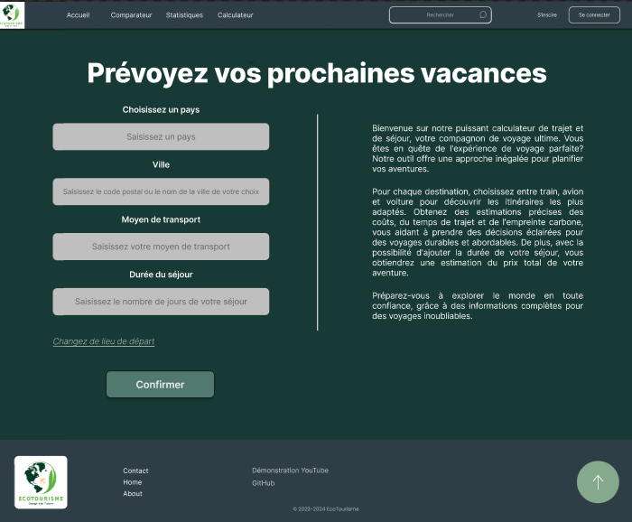{width="12cm" height="9.91cm"}-->
<!--Ratio 1.32-->
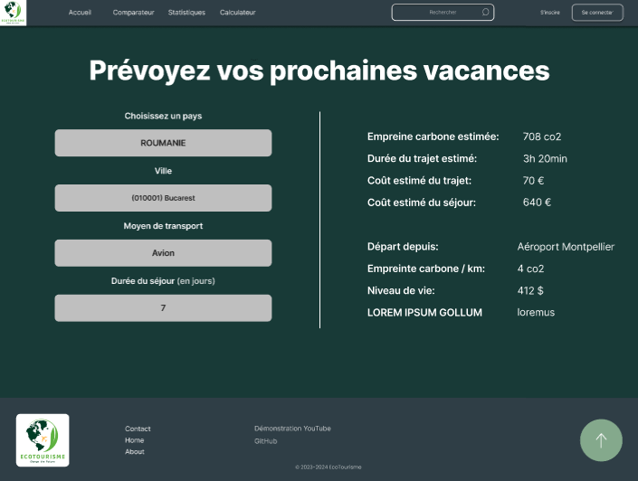{width="12cm" height="9.09cm"}

# Développement et outils
## Graphique
### Choix de notre bibliothèque
Une fois notre sujet et nos premières idées posées, nous nous sommes rendu compte que nous allions avoir besoin de deux choses importantes: de pouvoir créer des cartes (si possible interactives), car nous sommes sur un projet avec une dimension géographique, et des graphiques pour représenter nos données. Nous avons donc fait des recherches sur les outils existants et utilisables pour notre site. 

Notre intérêt s’est porté sur 3 bibliothèques JavaScript: Chart.js, Plotly et amCharts. Chacune a ses avantages et ses inconvénients, mais la puissance des cartes proposées par amCharts nous a orienté vers ce choix. Le principal problème de cette bibliothèque est sa complexité. C’est un outil très puissant mais dur à manipuler. Nous avons pris le pari d’arriver à nous en servir malgré tout, car nous avons jugé que ses possibilités et son esthétique valaient le coup.

Nous utilisons donc amCharts 5, édité par l’entreprise éponyme. Elle propose des licences payantes, qui permettent de retirer les logos de l’entreprise dans le coin des graphiques. Pour notre cas, ils ne sont pas dérangeants, nous resterons donc sur la version gratuite. Il n’y a pas d’installation nécessaire, son utilisation passe par un CDN qui permet de maintenir à jour la bibliothèque.

### Un exemple de graphique avec amCharts

Source: [démo amCharts](https://www.amcharts.com/demos/column-with-rotated-series/)

<!--Dimensions: 1442x615-->
<!--Ratio: 2.34-->
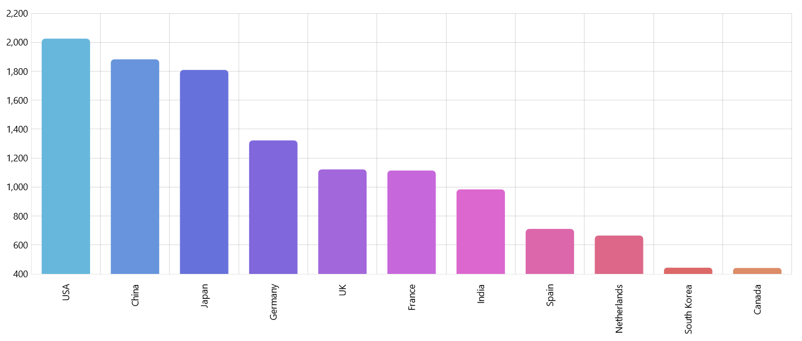{width="12cm" height="5.13cm"}
```{JavaScript}
am5.ready(function() {

  var root = am5.Root.new("chartdiv");

  root.setThemes([
    am5themes_Animated.new(root)
  ]);

  var chart = root.container.children.push(am5xy.XYChart.new(root, {
    panX: true,
    panY: true,
    wheelX: "panX",
    wheelY: "zoomX",
    pinchZoomX: true,
    paddingLeft:0,
    paddingRight:1
  }));

  var cursor = chart.set("cursor", am5xy.XYCursor.new(root, {}));
  cursor.lineY.set("visible", false);

  var xRenderer = am5xy.AxisRendererX.new(root, {
    minGridDistance: 30,
    minorGridEnabled: true
  });

  xRenderer.labels.template.setAll({
    rotation: -90,
    centerY: am5.p50,
    centerX: am5.p100,
    paddingRight: 15
  });

  xRenderer.grid.template.setAll({
    location: 1
  })

  var xAxis = chart.xAxes.push(am5xy.CategoryAxis.new(root, {
    maxDeviation: 0.3,
    categoryField: "country",
    renderer: xRenderer,
    tooltip: am5.Tooltip.new(root, {})
  }));

  var yRenderer = am5xy.AxisRendererY.new(root, {
    strokeOpacity: 0.1
  })

  var yAxis = chart.yAxes.push(am5xy.ValueAxis.new(root, {
    maxDeviation: 0.3,
    renderer: yRenderer
  }));

  var series = chart.series.push(am5xy.ColumnSeries.new(root, {
    name: "Series 1",
    xAxis: xAxis,
    yAxis: yAxis,
    valueYField: "value",
    sequencedInterpolation: true,
    categoryXField: "country",
    tooltip: am5.Tooltip.new(root, {
      labelText: "{valueY}"
    })
  }));

  series.columns.template.setAll({ cornerRadiusTL: 5, 
    cornerRadiusTR: 5, strokeOpacity: 0 });
  series.columns.template.adapters.add("fill", 
                                       function (fill, target) {
    return chart.get("colors").getIndex(
      series.columns.indexOf(target));
  });

  series.columns.template.adapters.add("stroke", 
                                       function (stroke, target) {
    return chart.get("colors").getIndex(
      series.columns.indexOf(target));
  });

  xAxis.data.setAll(data);
  series.data.setAll(data);

  series.appear(1000);
  chart.appear(1000, 100);


});
```

Ce programme fait 81 lignes. C’est énorme pour un simple histogramme. Mais en réalité si on décompose les instructions, on se rend compte que nous sommes en contrôle total de toute la zone de graphique. On doit créer les axes, leur rendu, le curseur, les boutons, les données, et toute fonctionnalité annexe que l’on souhaite. Tous ces éléments sont modulables à notre guise, il n’y a pas de pré-paramétrage. On peut donc faire afficher ce que l’on veut, à condition de comprendre ce qu’il se passe. Le but n’est pas d’expliquer en détail ce script là, mais de comprendre que cette complexité n’est pas inutile, et qu’en réalité elle est évitable.

### Encapsulation et simplification
En parcourant la documentation et les exemples d’amCharts, on remarque que beaucoup d’éléments se répètent, et c’est normal, car en réalité les graphiques ont presque tous le même corps “basique” que l’on ne veut pas forcément toucher sauf si on a un but précis. C’est la même chose pour nos graphiques: au fil de leur création, nous avons vu que les instructions de base sont toujours les mêmes: on a les mêmes axes pour chaque graphique par exemple. Souvent la différence va se jouer dans les objets que l’on manipule, pour créer un Spider Plot, il ne faut pas utiliser les mêmes objets amCharts que pour un Bar Plot, et c’est ce qui fait la différence dans le rendu. A part ça, le procédé de création est le même: on doit créer les axes, le curseur, la légende, modifier les couleurs, ajouter les séries de données et les styliser. Pour avoir de l’unité dans notre site, le style des graphiques et des données sont les mêmes pour chaque figure.
	
Cela nous a donné une idée: vu que notre base est toujours la même, pourquoi ne pas créer un nouvel objet “Graphique”, qui servira de constructeur commun à tous nos autres graphiques ? Un encapsulation qui permettrait aussi de mieux manipuler des variables qui jusque là étaient un peu en vrac dans nos scripts, et souvent globales. Leur nature globale fait qu’elles se transmettent entre chaque script importé dans notre page, et cela crée des conflits. Avoir une approche orientée objet nous simplifierait la tâche sur cet aspect.
	
C’est une sorte de surcharge de notre bibliothèque, mais elle est au final nécessaire pour mieux programmer. Cette classe de base serait une interface pour ensuite des classes plus spécifiques: Spider, Bar, Line, … . 

Nous n’allons pas montrer ici l’intégralité de notre classe mère que nous avons nommée “Graphique”, car l’expliquer demanderait 10 pages supplémentaires. Elle embarque un ensemble de méthodes et d’attributs pour générer des graphiques génériques. Ces méthodes vont attendre en argument des objets amCharts, qui vont déterminer la nature des graphiques. 

Ces objets sont manipulés dans des classes filles spécifiques par type de graphique: Line Chart, Bar Plot, Spider Plot par exemple. Voici par exemple une sous-classe “Spider”, qui permet de créer des Spider Plot et la fonction pour l’afficher sur notre page.

```{JavaScript}
class Spider extends Graphique {
    constructor(id) {
        super(id, am5radar.RadarChart, am5radar.RadarCursor)
    }

    initXAxis(field, data) {
        super.initXAxis(am5radar.AxisRendererCircular, field, data)
    }

    initYAxis() {
        var base = this
        this.yAxis = this.graph.yAxes.push(am5xy.ValueAxis.new(
          base.root, {
            min:0,
            max:100,
            renderer: base.newYRenderer(am5radar.AxisRendererRadial)
        }));
    }

    addSerie(data, name, color, xField, yField) {
        var serie = super.addSerie(data, name, color, xField, 
            yField, am5radar.RadarLineSeries, "{name}: {valueY}")
        super.addBullets(serie, color)
        return serie
    }
}
```

La classe Spider agit alors comme une boîte noire à laquelle nous avons confiance. Nous avons plus qu’à lui donner les données que l’on veut pour afficher la figure souhaitée. Elle sera par définition dans le même thème que toutes les autres, vu qu’elles héritent de la même base dictée par la classe “Graphique”.

```{JavaScript}
function spider(data1, data2, name1, name2) {
    g = new Spider("spider")
    g.initXAxis("var", data1["2020"])
    g.initYAxis()
    g.addLegend()

    seriesSp1 = g.addSerie(data1["2020"], name1, "#52796F",
                           "var", "value")
    seriesSp2 = g.addSerie(data2["2020"], name2, "#83A88B", 
                           "var", "value")
}
```

En 30 lignes, notre graphique spécifique est créé. 
	
A l’heure actuelle, la classe mère fait 100 lignes. La création de séries de données et de légendes est facilitée, et tous nos graphiques suivent des règles de mise en forme communes par ce biais. Au final, en fonction du nombre de graphiques qui seront au total dans notre site, l’économie de code pourrait s’élever à plus de 1000 lignes. La lisibilité et le maintien du code sont aussi garantis. 

Cette classe est encore expérimentale. Nous pensons qu’elle nous fait aller dans le bon sens, en terme de bonne pratique de code et d’utilisation. L’objectif est de faire de cette classe notre socle pour les graphiques, de l’optimiser, de la rendre modulable et compatible avec des manipulations DOM, HTMX et AJAX. Ce n’est pour l’instant pas totalement le cas.

## Carte
### Introduction
Le principal argument pour utiliser amCharts 5 était la possibilité de faire des cartes puissantes. Nous allons maintenant voir ce qu’il en retourne. A noter que nous sortons du schéma orienté objet présenté précédemment. Ce ne sont pas les mêmes classes et attributs à manipuler, et son interactivité est incomparable. La carte que nous avons créé est encapsulée dans un autre objet indépendant, qui permet aussi une meilleure lisibilité du code.

Les cartes amCharts restent dans la même idée que le reste: dures à manipuler, mais une fois faites, elles deviennent un véritable atout pour notre interface.
	
L’objectif est d’obtenir une carte intéractive pour pouvoir se déplacer et chercher rapidement des pays, en complément à notre barre de recherche. Elle doit être très visuelle et intuitive, grâce à des événements au survol ou au clic. Elle permet aussi d’afficher des données, comme des villes par exemple.

Son exploitation reste pour le moment expérimentale, comme tout ce qui est présenté dans cette partie technique. Tout tend à évoluer.

Dans la suite de cette partie, le code ne sera pas détaillé de manière complète. Il est assez lourd et l’important à savoir est que chaque pays est un objet “Polygon”, compris dans une série de données et qu’il est soumis à divers événements que nous allons contrôler. Nous avons la main sur tous les zooms, les pays masqués, l’esthétique de la carte et tout ce que l’utilisateur pourrait faire en termes de manipulations.

### Aspect de base

<!--Dimensions: 1600x900-->
<!--Ratio: 1.77-->
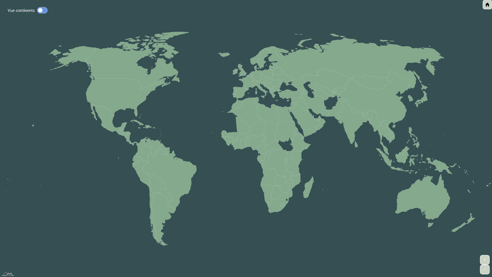{width="12cm" height="6.77cm"}

Voici notre première carte. Comme vu dans la partie maquettage, elle sera affichée sur notre page d’accueil et celle de statistiques. C’est une carte du monde classique, mis à part quelques espaces vides, car ce sont les pays que nous avons retiré de notre base de données pour des raisons expliquées plus tôt.

Plusieurs boutons dans les coins de la carte permettent de contrôler la vue: zoomer, revenir à l’affichage de base, et passer sur une vue “continent”, où les formes des continents sont mises en valeur.

En première approche donc, elle n’a rien de spécial, c’est une carte tout à fait normale et élégante. Derrière cet affichage se cache une classe nommée “EcoMap”, qui encapsule toutes les actions nécessaires à l’affichage de la carte.

### Action au survol
Maintenant que nous avons ce patron, il faut le rendre intéressant et intéractif. Un premier événement que nous allons voir est le survol, ou “hover”. Nous avons décidé d’abord de mettre en évidence le pays survolé en changeant sa couleur.

Quelque chose d’intéressant dans amCharts est la possibilité d’intégrer du HTML dans les graphiques. Notamment dans ce qui est appelé “Tooltip”: la zone qui est affichée quand un élément quelconque est survolé. S’il n’est pas configuré, seul le nom du pays est présent quand on survole un Polygon. 

<!--Dimensions: 564x486-->
<!--Ratio: 1.16-->
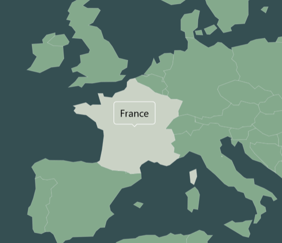{width="12cm" height="10.34cm"}

C’est bien, mais cela ne nous suffit pas, nous voulons quelque chose de plus visuel et qui ressemble aux bandeaux que nous avons créés. Nous lui transmettons alors ce script HTML: 

```{HTML}
<div style="display: grid; grid-template-columns: repeat(2, 1fr); 
grid-template-rows: repeat(1,100px); width: 240px; height: 80px; 
justify-content: center; align-items: center; word-break: break-word; 
text-align: center; font-family: Arial, Helvetica, sans-serif;">
      
      <div style="grid-column: 2; grid-row: 1; 
justify-content: center;">
            <h1 style="font-size: 20px; color: white;  ">{name}</h1>
      </div>
      <div style="grid-column: 1; grid-row: 1; width: 100%;">
            
      </div>
</div>
```

Malheureusement, nous ne pouvons pas fournir de balise <style> pour embarquer nos règles CSS et sommes obligés de faire avec les attributs style de chaque balise.
	
Ce qui rend ce script personnalisé pour chaque pays est la présence dans le code des balises {name} et {id}. Elles seront remplacées automatiquement par les arguments correspondants et liés au polygone qui est survolé.

Cela donne ce résultat: 

<!--Dimensions: 490x375-->
<!--Ratio: 1.3-->
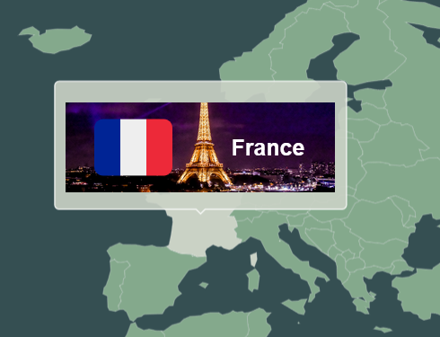{width="12cm" height="9.23cm"}

Les images et drapeaux proviennent de nos assets.

### Action à la sélection
Un pays peut être sélectionné de différentes façons. La plus évidente est au clic sur la carte, mais il peut l’être aussi depuis l’URL directement, ainsi que via une recherche sur notre site. Dans chaque cas, la sélection se traduit sur la carte par “l’activation” du polygone du pays dans notre carte. C’est un attribut proposé par amCharts, et dont on peut contrôler le comportement via des événements.

Quand le pays est choisi par la carte, les événements se déclenchent de manière automatique. Dans les autres cas, il faut récupérer l’objet Polygon que l’on veut, et faire basculer son attribut “active” manuellement.

```{JavaScript}
// this.countries est la série des pays de la carte
var elem = this.countries.getDataItemById(id_pays)
elem._settings.mapPolygon.set("active",true)
```

Voici ce qui ce passe quand un pays est sélectionné sur notre carte: 

<!--Dimensions: 1600x900-->
<!--Ratio:1.77-->
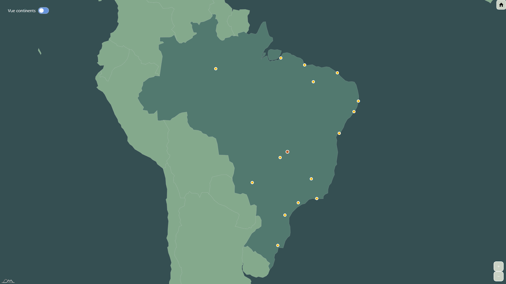{width="12cm" height="6.77cm"}

Ici, on a cliqué sur le Brésil. La carte a effectué un zoom et un centrage sur le pays, qui est passé en couleur foncée pour être mis en avant. A cela s’ajoute les villes majeures du Brésil, représentées par les points jaunes. Le point rouge symbolise la capitale Brasilia. 

Les villes ont été récupérées par une requête AJAX à notre serveur, qui après des appels à la base de données sur la table villes, renvoie un liste formatée utilisable par amCharts pour positionner les points. On doit fournir les positions géographiques de chaque ville pour qu’elles apparaissent. Au survol des points le nom des villes apparaît. 

Si on clique sur un pays différent, le comportement se répète, en retirant toutes les informations du pays précédent: villes supprimées et couleur qui revient à la normale. Pour amCharts, ce n’est pas automatique ! Si un pays est déclaré actif une fois, mais que l’on ne précise pas quand il ne l’est plus, alors il le reste. Cela nécessite de stocker le dernier Polygon activé, et de le désactiver manuellement quand un nouveau pays est sélectionné.

Aussi, on retire la nature interactive des Polygon quand ils sont sélectionnés, afin que le comportement hover et active ne se produisent plus.

### Comparateur

Comme vu dans la partie maquettage, une page comparateur est prévue. Celle-ci doit aussi avoir une carte, mais avec un comportement différent. Jusqu’ici, celle présentée ne permet la sélection que d’un seul pays simultanément: dès qu’un nouveau pays est sélectionné, il est mis en avant, et le précédent revient à sa forme normale. On veut donc pouvoir choisir et afficher plusieurs pays à la fois, et cela nécessite des aménagements.

En termes de structure de code, la carte est exactement la même. On ne crée pas de nouvelle classe, juste de nouvelles méthodes. Notre architecture est faite de façon que notre objet carte ne génère rien par défaut. C’est nous qui modulons son comportement après l’avoir instancié. On a donc une fonction spéciale pour la page comparateur, qui instancie une carte et appelle les méthodes que l’on veut pour personnaliser l’expérience. Le changement majeur ici est dans la création de la série de pays: on ne va pas donner les mêmes instructions lors de l’événement d’activation.
De plus, plus tard notre carte devra s’adapter et se moduler à un passage du mode pays à comparateur et inversement sans avoir à se recharger. Nous avons déjà mis en place en début de structure permettant cela, mais qui se précisera plus tard.

Voici le résultat: 

<!--Dimensions: 888x421-->
<!--Ratio:2.11-->
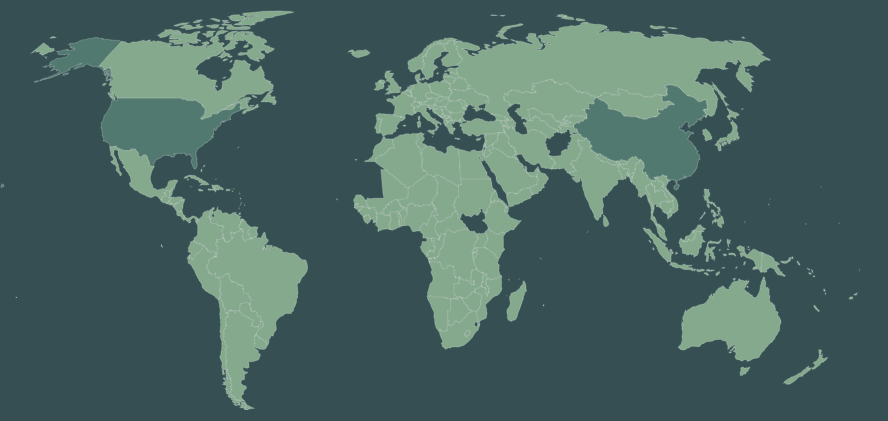{width="12cm" height="5.69cm"}

Ici on a choisi les États-Unis et la Chine.

A la sélection donc, les villes ne sont plus affichées et les pays ne sont plus zoomés non plus. Ils sont juste affichés avec une couleur différente. L’enjeu est dans le stockage et l’alternance des pays. Imaginons que nous avons un pays 0 et un pays 1. Si on clique sur un pays depuis la carte, le pays 0 va changer. Et au prochain clic, ce sera le pays 1 qui changera. Puis à nouveau le pays 0. Nous avons programmé ce comportement, qui pourra peut-être changer. Le code est fait de façon qu’il s’adapte au nombre de pays maximum que l’on veut: si on précise que l’on peut comparer trois pays ensemble, alors l’alternance se fera sur une base de trois.

Cette carte est spécifique à la page comparateur, nous pouvons y faire des modifications uniques qui n'impacteront que cette page. À l'heure actuelle donc, la sélection d'un pays fait un appel AJAX à notre serveur pour rafraîchir toutes les données affichées sur la page. C'est une pratique expérimentale qui sera peut-être généralisée aux autres pages de statistiques.


## Page Comparateur
La Comparateur a une portée analytique très importante, qui se doit de compléter les pages individuelles des pays. Sa réalisation technique passe par un croisement efficace des données de plusieurs territoires. 

Actuellement, cet outil est limité à deux pays, mais des mesures ont déjà été prises en vue d'une éventuelle expansion permettant des comparaisons théoriquement illimitées. Néanmoins, pour des raisons de lisibilité, notre maximum sera probablement de l'ordre de 3 à 5 pays. 

L'équipe chargée de la réalisation de cette page a réussi à avancer vite, et a donc pu faire beaucoup d'essais de concepts pour la faire fonctionner au mieux. On pourrait considérer qu'elle fait figure de laboratoire pour possiblement appliquer plus tard les méthodes validées aux autres pages. Il y a donc beaucoup d'expérimentation dans ce qui suit. 

### Structure PHP, relation avec AJAX
Le code de cette page a beaucoup évolué au cours de sa création. A la base, nous avions une grande page PHP statique, qui récupérait toutes les données nécessaires pour construire les graphiques, et les envoyait dans des fonctions JavaScript. C’est l’approche normale. Mais un constat nous a fait remettre en question cette manière de faire: la carte est plus puissante que ce que l’on pense, et un de ses inconvénients pourrait devenir un avantage. Comme expliqué précédemment, elle embarque une série d’événements, que nous avons programmés quand un pays est sélectionné par l’utilisateur. Ces événements ont été personnalisés pour cette page en particulier, et nous allons en profiter. 

Un des objectifs annexes de notre site est d’assurer une fluidité totale entre chaque page. Cela passe par un retrait des rechargements par le navigateur. Pour se faire, il faut effectuer des requêtes à notre serveur, et modifier le contenu des pages de manière dynamique. On utilise une technologie très répandue et populaire: l’Asynchronous JavaScript And XML, abrégé communément en AJAX. Elle va nous permettre de communiquer de manière discrète à notre serveur, et de recevoir de nouvelles données, selon nos demandes.

Donc quel rapport avec notre carte ? Lors de chaque sélection de pays, une fonction est appelée pendant l’événement d’activation pour effectuer une requête AJAX et récupérer toutes les informations le concernant. Une fois fait, le contenu de la page va s’ajuster via l’utilisation de jQuery et la manipulation d’amCharts: le bandeau du pays change, et les statistiques des graphiques aussi. Les changements dans les graphiques demandent l’écriture de fonctions spécifiques pour chaque figure, afin de bien ajuster les données.

Cette sélection comporte une subtilité importante: on ne peut pas donner à la carte une liste de pays qui sont activés de base. Nous sommes obligés d’effectuer ce processus manuellement dès que la carte est prête. Notre comparateur n’est jamais vide, il y a toujours deux pays qui sont choisis quoi qu’il se passe. Dès lors, au premier chargement de la page, il est nécessaire d’activer nos pays de base. Cela signifie que dès que la page est chargée, deux événements d’activation sont déclenchés, avec leur comportement programmé: deux requêtes AJAX sont envoyées, et les données de la page sont actualisées pour les deux territoires.

A partir de ce moment-là, plus besoin de précharger les données dans le script PHP, mais simplement laisser la carte agir, elle remplira la page à notre place. C’est un avantage conséquent, car jusque-là nous avions une multiplication du code, car le formatage des données entre la version PHP et la version AJAX n’était pas le même. Dès lors, notre page PHP ne contient que des conteneurs HTML et des graphiques vides, qui attendent d’être remplis. 

### Requêtes SQL: focus sur notre Line Chart
Derrière chaque graphique se cache des requêtes SQL pour récupérer nos données, et une en particulier est intéressante, celle du line chart. Cette requête utilise toutes les tables de statistiques de notre base de données, et l'interactivité de ce graphique permet de comparer chaque indicateur indépendamment les uns des autres.

<!--Dimensions:807x429-->
<!--Ratio:1.88-->
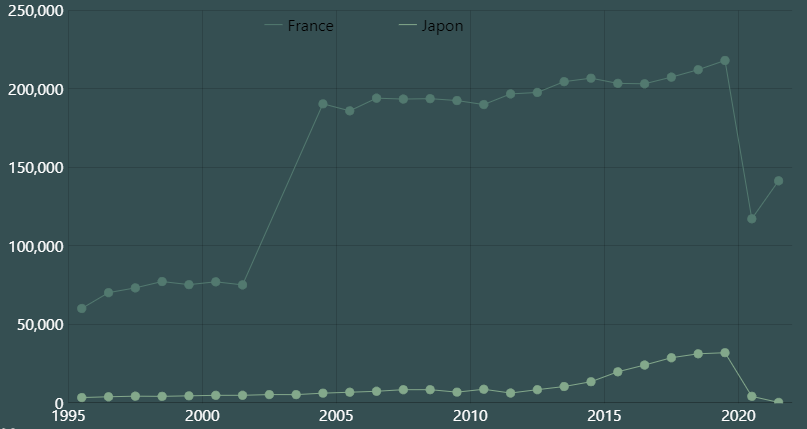{width="12cm" height="6.38cm"}

Pour ne pas avoir à faire quatre requêtes SQL différentes pour chaque table, on choisit de faire une seule grande requête en joignant toutes les tables entre elles, par l’année et le pays de chaque ligne.

```{JavaScript}
SELECT allk.id_pays, allk.annee AS year, co2, elecRenew AS Enr, pibParHab AS pib, cpi, gpi, arriveesTotal*1000 AS arrivees, departs*1000 AS departs
    FROM ( id_pays, annee FROM economie UNION
            SESELECTLECT id_pays, annee FROM tourisme UNION
            SELECT id_pays, annee FROM surete UNION
            SELECT id_pays, annee FROM ecologie
            ) allk
    LEFT OUTER JOIN economie ON allk.id_pays = economie.id_pays 
      AND allk.annee = economie.annee
    LEFT OUTER JOIN ecologie ON allk.id_pays = ecologie.id_pays 
      AND allk.annee = ecologie.annee
    LEFT OUTER JOIN surete ON allk.id_pays = surete.id_pays 
      AND allk.annee = surete.annee
    LEFT OUTER JOIN tourisme ON allk.id_pays = tourisme.id_pays 
      AND allk.annee = tourisme.annee
    WHERE allk.id_pays = '$pays'
    ORDER BY allk.annee;";
```

Cette requête est assez complexe. La difficulté de ce genre de jointure est que chaque table ne possède pas la même étendue de temps. Elle effectue une union des tables économie, tourisme, sûreté, et écologie pour obtenir une liste complète des années disponibles pour chaque pays, sous un table nommée allk. Ensuite, elle utilise des jointures gauche (LEFT OUTER JOIN) pour rassembler toutes les statistiques sur cette table temporaire. Les colonnes sélectionnées incluent divers indicateurs tels que les émissions de CO2, les énergies renouvelables, le PIB par habitant, le Consumer Price Index (CPI), l'Indice de Paix Globale (GPI), les arrivées touristiques, et les départs.

Si nous avions fait une requête classique, sans table intermédiaire, l’affichage aurait été tronqué, car l’espace de temps choisi aurait été celui de la première table choisie, alors que nous voulions avoir l’étendue maximale. Les valeurs manquantes sont remplacées par NULL.

Pour cette figure nous voulions une dynamique interactive, alors nous avons ajouté des boutons permettant de choisir quel indicateur consulter.


<!--Dimensions:947x63-->
<!--Ratio:15-->
{width="12cm" height="0.8cm"}

Avec les données transmises, le clic sur n’importe quel bouton appelle une fonction qui modifie pour chaque série de données quelle colonne afficher, sans avoir à faire de requête SQL supplémentaire, car tout est déjà stocké. Une autre fonction a été écrite pour adapter l’échelle de l’axe X, car elle dépend d’étiquettes statiques.

### Démarquage de la maquette
Dans l’ensemble, nous nous sommes assez éloignés de la maquette sur cette page. Plus nous étions dans la création, plus nous avons aperçu les limites de notre design initial, et avons cherché de nouvelles solutions. Elles seront peut-être conservées ou non.


<!--Dimensions:1600x900-->
<!--Ratio:1.77-->
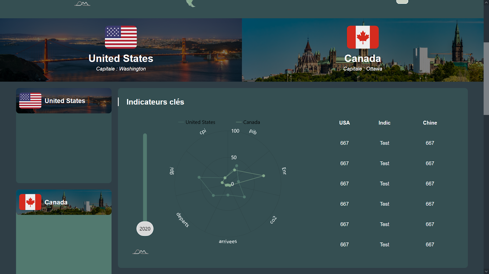{width="15cm" height="8.47cm"}

Tout d’abord, nous avons ajouté un Spider Plot qui n’était pas prévu de base. Il est inspiré de celui qui est prévu pour la page Pays. Le slider latéral permet de changer l’année des données affichées.

L'ajout de compartiments pour chaque partie graphique améliore la lisibilité et la compréhension globale. Ces sous-parties distinguées offrent une structure visuelle claire, permettant aux utilisateurs de différencier facilement les divers éléments graphiques présentés. Les marges offrent une vraie séparation, meilleures que le simple changement de couleur.

Une innovation notable sur la page "Comparateur" est la séparation de la page en deux: le corps principal, et une petite partie latérale affichant des informations complémentaires aidant à la navigation. Ce panneau augmente l'accessibilité et pourrait renforcer l’expérience utilisateur, déjà en créant de l’espace. Ce qui s’y figurera n’est pas encore totalement défini. Ici, il est pensé des petits encarts pour des stats complémentaires pour chaque pays, et un sommaire pour la navigation. Il est aussi possible qu’il devienne sticky.

Si toutes ces implémentations de style et de lisibilité sont convaincantes, elles seront intégrées aux autres pages de statistiques.

## Page Monde
Comme pour toutes les pages de notre projet, elle repose sur un script PHP dans lequel nous avons inséré différents graphiques et éléments d’analyses, ici pour afficher des statistiques mondiales. Cette page comporte trois graphiques, notre carte interactive, la navbar et le footer. Elle suit globalement ce qui a été pensé lors du maquettage, sans artifice particulier. Cette page n'est pas finale et manque encore des éléments pour
qu'elle fonctionne totalement, elle sera donc améliorée et terminée dans un futur proche.
Tout d’abord nous avons créé nos graphiques. Le premier graphique correspond aux dix premiers pays avec le plus d'arrivées touristiques. Pour cela nous nous sommes basés sur un graphique amCharts, que nous avons adapté, avec une requête permettant d’obtenir les arrivées touristiques (table tourisme) et les pays correspondants (table pays). Nous avons sélectionné les 10 premiers pays afin d’établir un classement.

```{SQL}
SELECT pays.nom AS country, SUM(tourisme.arriveesTotal) AS value
FROM tourisme, pays 
WHERE tourisme.id_pays = pays.id 
GROUP BY pays.nom 
ORDER BY value DESC
LIMIT 10;
```

Le deuxième graphique va permettre de faire une moyenne des différents score écotourisme dans le Monde. Mais les scores ne sont pas encore calculés donc le graphique ne peut pas encore être relié à la base de données.
Pour finir, nous avons imaginé une treemap: un graphique qui permet de visualiser les données de manière hiérarchisées. Elle représente la proportion des arrivées touristiques par pays et par continent. Il est lié à la base de données mais n’est pas complètement terminé. On observe pour l’instant seulement la proportion par contient, mais nous n’avons pas encore réussi à le faire par pays. Pour générer ce graphique, nous avons utilisé une requête qui relie la table pays, continent et tourisme.

```{SQL}
SELECT 
    continents.nom as continent, 
    pays.nom AS pays, 
    SUM(tourisme.arriveesTotal) as arrivees_par_continent 
FROM 
    tourisme, continents, pays 
WHERE 
    tourisme.id_pays = pays.id AND 
    pays.id_continent = continents.id 
GROUP BY 
    continents.nom
ORDER BY 
    continents.nom, arrivees_par_continent DESC;
```

Ensuite, nous avons créé une feuille de style CSS qui suit ce qui a été imaginé dans le maquettage Figma. Pour la navbar et le footer, ils ne sont pas encore créés et seront incorporés à toutes les pages courant janvier.

# Planning
La planification d’un projet demeure un élément crucial pour assurer une progression efficace et la réussite du projet. Nous avons mis en place un planning, en prenant en compte les ajustements nécessaires pour répondre aux éventuels défis rencontrés. Nous avons utilisé le logiciel Mindview pour fournir une visualisation claire des tâches et des dépendances. Le diagramme généré a été d'une grande valeur pour la communication interne et a facilité la compréhension des membres de l'équipe sur les différentes phases du projet. Ainsi il nous servira à illustrer ce rapport.

## Global
<!--Dimensions: 541 × 126-->
<!--Ratio de 4.29-->
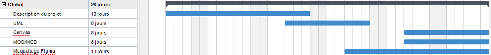{width="12cm" height="2.79cm"}

Au cours des premiers cycles du projet, l'équipe a consacré une attention particulière à plusieurs phases clés, conformément au planning initial. Les activités suivantes ont été menées avec succès, contribuant à l'avancement global du projet:

- **Description du Projet (13 jours):**
Les réunions de travail ont permis de définir clairement les objectifs et les besoins d’écotourisme. Pour avoir une vision plus globale et claire.

- **Modélisation UML (8 jours):**
Dans cette phase, l'équipe a consacré huit jours à la création de modèles UML détaillés. Ces modèles ont servi de fondement conceptuel, facilitant la visualisation des différentes composantes site.

- **Élaboration du Canevas (8 jours):**
Le canevas du projet, fournit une représentation visuelle de l'architecture globale. Cette étape a permis de valider les besoins du projet avant de passer à des phases plus détaillées.

- **Conception MCD/MOD (8 jours):**
Huit jours ont été alloués à la conception du Modèle Conceptuel de Données (MCD) et du Modèle Organisationnel de Données (MOD). Ces modèles ont permis de définir la structure des données et les relations, guidant ainsi le développement ultérieur.

- **Maquettage avec Figma (13 jours):**
Comme décrit plus tôt la phase de maquettage avec Figma a occupé treize jours, pendant lesquels l'équipe a créé des maquettes interactives et visuelles du projet. 
Même si le temps de réalisation en nombre de jour est similaire aux autres tâches, celle-ci nous a demandé un investissement plus important, par la quantité de travail qu'elle représente. Élaborer un diagramme n'est pas comparable à imaginer une dizaine de pages Web, et le résultat a été obtenu par une concentration particulière de tous nos moyens sur cet objectif.

Ainsi comme montré sur l’image plus tôt la mise en place avant codage nous a pris 1 mois complet afin de cerner l’entièreté des enjeux de ce projet. On remarque aussi que l’organisation de notre groupe nous a permis de travailler en différé sur ces taches et ainsi de gagner un temps précieux.

\newpage
## Partie Base de Données
<!-- Ratio de 3.14 -->
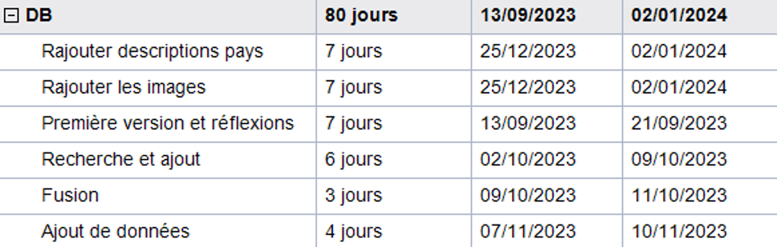{width="12cm" height="3.82cm"}

La gestion évolutive de la base de données a été une composante cruciale du développement du projet, consolidant progressivement les données touristiques, économiques et diverses pour offrir une expérience riche et complète. Voici un aperçu détaillé des différentes étapes de développement dans la partie base de données:

- **13/09 - 21/09:**
Au cours de cette phase initiale, la première version de la base de données a été élaborée, avec un accent particulier sur les données touristiques et les informations essentielles sur chaque pays. Des réflexions approfondies ont orienté la conception initiale pour garantir une fondation solide.
- **21/09 - 30/09:**
Recherche et Ajout de Données Complémentaires, Économie, Écologie et Sûreté, Mise en Place des Clés Étrangères (9 jours)
La base de données a été enrichie par des données complémentaires, notamment des informations sur l'économie, l'écologie et la sûreté des pays. Les clés étrangères ont été soigneusement mises en place pour établir des relations significatives entre les différentes tables.
- **02/10 - 09/10:**
Réflexion et Ajouts Mineurs: PIB/hab, Continents, Emojis (8 jours)
Cette période a été consacrée à des réflexions approfondies, conduisant à des ajouts mineurs mais significatifs tels que le PIB par habitant, la classification par continents et l'introduction d'emojis pour représenter les drapeaux de nos pays afin d’obtenir une expérience utilisateur plus visuelle et intuitive.
- **09/10 - 11/10:**
Fusion des Tables par Thèmes (2 jours)
Une étape importante a été la fusion des tables par thèmes, améliorant ainsi la cohérence et la facilité d'accès aux données. Cette restructuration a contribué à simplifier la gestion de la base de données et à rendre les requêtes plus efficientes.
- **07/11 - 12/11:**
Ajout des Données sur les Aéroports et les Routes Aériennes (6 jours)
L'expansion de la base de données a continué avec l'intégration de données sur les aéroports et les routes aériennes. Cette addition a considérablement enrichi le volet logistique du projet, offrant aux utilisateurs des informations détaillées sur les infrastructures aériennes.
Ajout d'Images pour Chaque Pays: La base de données sera étendue pour inclure des images associées à chaque pays, améliorant ainsi l'expérience utilisateur en offrant une représentation visuelle.
- **Gestion Continue:**
En reconnaissance du caractère dynamique de la base de données, une approche agile sera maintenue pour permettre des mises à jour régulières en fonction des besoins changeants du projet écotourisme.

\newpage
## Carte
<!--Ratio de 3.73-->
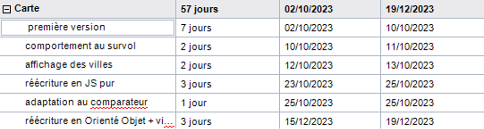{width="12cm" height="3.21cm"}

- **02/10 - 10/10:**
Première Version (Fond de Carte, Tests) (9 jours)
Durant cette période, l'équipe a concentré ses efforts sur la création de la première version de la carte. C'était la première fois que nous approchions cet outil, et la création de cette version initiale visait à explorer les fonctionnalités offertes et à évaluer sa pertinence. Cette étape préliminaire était importante pour prendre une décision sur l'utilisation de l'outil, ce qui a confirmé notre choix de poursuivre avec amCharts.
- **10/10 - 11/10:**
Comportement au survol (HTML des Mini-Cartes, Tests) (2 jours)
Cette étape a été guidée par les premiers bandeaux réalisés pour la page pays, servant de référence pour rédiger le code HTML des mini-cartes au survol. Ceci a renforcé la cohérence de l'interface utilisateur.
- **12/10 - 13/10:**
Affichage des Villes, Focus sur un Pays (2 jours)
Ces deux jours ont été consacrés à l'extension des fonctionnalités du projet, notamment l'affichage des villes et la fonction de mise en évidence d'un pays spécifique. Ces ajouts enrichissent l'expérience utilisateur en fournissant des informations un peu plus détaillées sur les différentes pays. 
- **23/10 - 25/10:** 
Réécriture en JS Pur (3 jours)
Une évolution majeure a eu lieu avec la réécriture du code en JavaScript pur. Cette transition vers un fichier séparé permet de réutiliser la carte dans n'importe quelle page souhaitée, anticipant notamment notre future page comparateur. Ce qui renforce l'efficacité du développement et la maintenance à long terme.
- **25/10:**
Adaptation au Comparateur (Comportement au Clic pour Deux Pays) (1 jour)
Pour rendre le projet plus polyvalent, des ajustements ont été apportés pour permettre le support de deux pays mis en avant au lieu d'un seul. Ces modifications s'alignent avec notre vision d'extension future du projet vers une page comparateur entre pays.
- **15/12 - 17/12:** 
Réécriture en Orienté Objet + Villes Dynamiques au Clic (3 jours)
Une refonte majeure a été entreprise en adoptant une approche orientée objet. Inspirée par l'architecture POO mise en place pour les graphiques, cette transition améliore la lisibilité du code, favorise la réutilisation des fonctionnalités, et simplifie la gestion des futures évolutions du projet.

\newpage
## Page Pays / Monde / Comparateur

<!--Ratio de 2.65-->

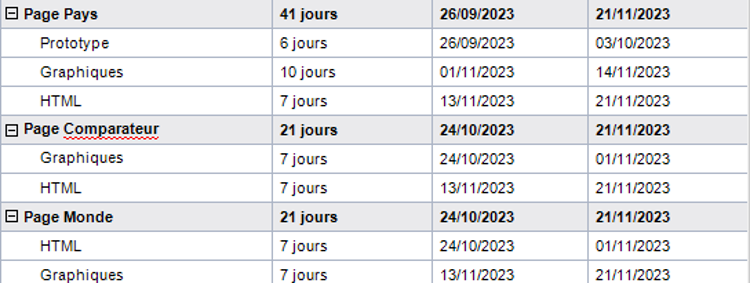{width="12cm" height="4.52cm"}

Chaque page, caractérisée par des fonctionnalités graphiques avancées, a fait l'objet d'un travail en binôme, favorisant la collaboration et la génération d'idées innovantes. Initialement planifiées sur une plage de 21 à 41 jours, ces périodes ont été recalculées et étendues jusqu'au 22 décembre en raison de contraintes imprévues. (Partiels et difficultés sous-estimées).

- **Page Pays:**
La page pays a été conçue pour offrir une expérience approfondie, avec des graphiques détaillés reflétant diverses données économiques, touristiques et environnementales. 
- **Page Monde:**
La complexité des graphiques de la page Monde, agrégeant des données de multiples pays, a demandé une période étendue pour garantir une représentation précise.
- **Page Comparateur**
La page comparateur, met en œuvre des graphiques comparatifs entre deux pays, a exigé une période supplémentaire pour perfectionner les interactions utilisateur. L'extension a permis d'affiner les fonctionnalités de comparaison, d'ajuster les détails visuels et de garantir une expérience plus fluide.La mise en œuvre de fonctionnalités graphiques avancées a aussi été mis en place.

## Pages annexes

<!--Ratio de 2-->
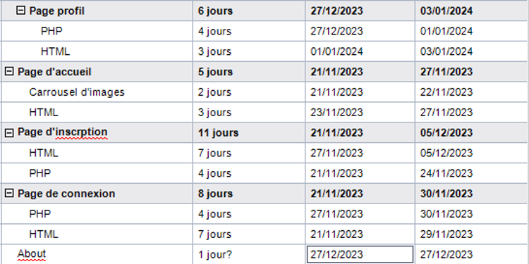{width="12cm" height="6cm"}

La conception et le développement des pages Profil, Inscription, Connexion, About, Catalogue des Pays, ainsi que la Footer/Navbar ont été impactés par les ajustements précédents. En effet, nous pensions faire ces pages en premier lieu, cependant nous avons eu d'autres rendus ce qui nous a ralenti dans notre dynamique productive. Ainsi, nous avons décidé de retarder ces tâches pour les vacances de fin d'année comme il suit:

- **Page Profil (18/12 - 15/01):** 
Cette page centrale accueillera les fonctionnalités de gestion de profil utilisateur, offrant une expérience personnalisée.
- **Pages d'Inscription et de Connexion (18/12 - 15/01):**
Ces pages seront créées pour une inscription et une connexion sécurisée.
- **Page About (18/12 - 15/01):**
La page About bénéficiera également d'ajustements pour refléter les dernières améliorations apportées aux autres pages. La période étendue permettra d'approfondir la présentation du projet, de l'équipe et des objectifs globaux.
- **Catalogue des Pays (18/12 - 15/01):**
La création du catalogue des pays facilitera la navigation à travers les informations, offrant une expérience plus rapide et conviviale. Cette fonctionnalité optimisera la recherche d'informations spécifiques sur les différents pays / continent présents dans la base de données.
- **Footer/Navbar (18/12 - 15/01):**
Le Footer  et la Navbar, seront ajustés pour assurer une navigation intuitive sur l'ensemble du site. Les liens vers les différentes pages, y compris les nouvelles, seront intégrés de manière cohérente.

\tiny NB: Dû aux fêtes de fin d'année, nous nous laissons un délai supérieur à la normale afin de se reposer
\normalsize

\newpage

## Dernière pages et enjeux cruciaux
 
Au cours de la période s'étendant du 15 janvier au 29 janvier, les efforts de développement seront concentrés sur la création des pages Continent et Calculateur. Parallèlement, un contrôle qualité exhaustif sera effectué sur l'ensemble des pages du site pour garantir une expérience utilisateur homogène. Ces pages ont également été affectées par les ajustements de planning antérieurs.

- **Page Continent (15/01 - 29/01):**
La page Continent  a été conçue pour offrir une expérience approfondie, avec des graphiques détaillés reflétant diverses données économiques, touristiques et environnementales, elle est proche de la page pays. 
- **Page Calculateur (15/01 - 29/01):**
La page Calculateur, semble complexe, mais sera développée pendant cette période. Le calcul de l'indice, le contrôle qualité des résultats, et l'ajustement visuel seront les priorités. La précisions des calcule est pour nous un enjeu majeur de notre projet car sans cela notre site per une grande partie de son utilité.
- **Contrôle Qualité Global (15/01 - 29/01):**
Simultanément au développement des nouvelles pages, un contrôle qualité complet sera réalisé sur l'ensemble du site. Chaque page sera passée en revue pour s'assurer de la cohérence des styles CSS, de la précision des fonctionnalités, et de la fluidité de l'expérience utilisateur. Des ajustements seront apportés si nécessaire.

## Conclusion planning
Nous avons rencontré des difficultés imprévues, notamment des contraintes de temps dues à la complexité des tâches ainsi qu'aux facteurs externes (examens...) ainsi des ajustements ont été nécessaires. Chaque membre de l'équipe s'est investi dans des domaines spécifiques (pages différentes sur fonctionnement de binôme et tâches annexes), permettant une meilleure efficacité. La collaboration en binôme a renforcé la créativité et la résolution de problèmes, favorisant ainsi de meilleurs résultats. À l'approche de la phase finale du projet, nous restons résolus à surmonter les obstacles restants et à livrer un site final répondant aux normes élevées que nous avons fixées.

# Conclusion{.unnumbered}
Pour conclure ce rapport, Écotourisme se dresse comme une réponse novatrice aux défis environnementaux posés par l'industrie du tourisme. À l'heure où ce secteur contribue de manière significative aux émissions de gaz à effet de serre, notre plateforme incite à une approche plus responsable du voyage.\par
Notre engagement en faveur d'un tourisme responsable se manifeste à travers une approche intégrée. Écotourisme n'est pas seulement une plateforme économique, mais un écosystème complet où le plaisir du voyage coexiste avec la responsabilité écologique. 
Ce rapport, subdivisé en plusieurs parties clés, témoigne de notre engagement envers la transparence. À travers la présentation des objectifs, de la base de données, du développement, et des outils, nous partageons chaque étape de notre parcours. 
Lors de la conception et du développement de notre plateforme Écotourisme, certaines contraintes et limitations cruciales ont été prises en compte pour garantir le succès du projet. Elles et limitations guideront notre équipe tout au long du projet, garantissant que notre plateforme Écotourisme répondra aux normes les plus élevées, tout en restant flexible et innovante dans sa conception et son développement.\par
La section dédiée à l'empreinte carbone souligne l'importance cruciale de comprendre les conséquences environnementales de nos choix de déplacement. En mettant en lumière les émissions de CO2 associées à différents trajets, nous avons souhaité éduquer nos utilisateurs et les inciter à des choix de voyage plus durables.\par
Écotourisme n'est pas simplement une plateforme de voyage, mais une invitation à repenser la manière dont nous explorons le monde. Nous croyons en un avenir où le plaisir du voyage s'aligne avec la préservation de notre planète.\par
Ensemble, avec nos utilisateurs, et la communauté mondiale, nous façonnons un avenir du tourisme plus respectueux, plus vert, et plus durable. Rejoignez-nous dans cette aventure vers un monde où chaque voyage compte, non seulement pour nous, mais aussi pour les générations futures. Voyagez avec conscience. 

\Huge 
\center
\vskip 1.69em
***Voyagez avec Écotourisme.***