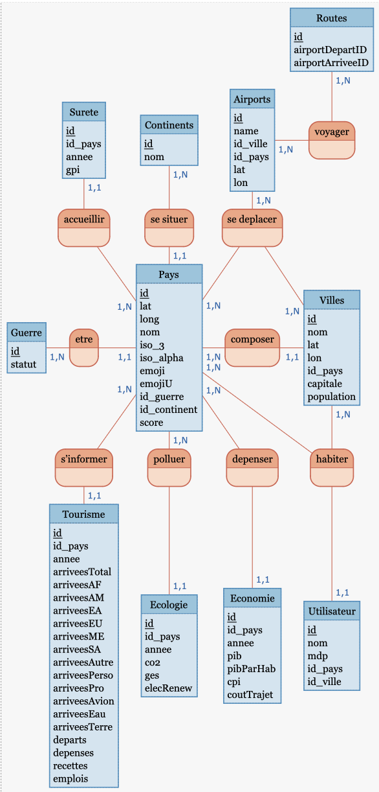
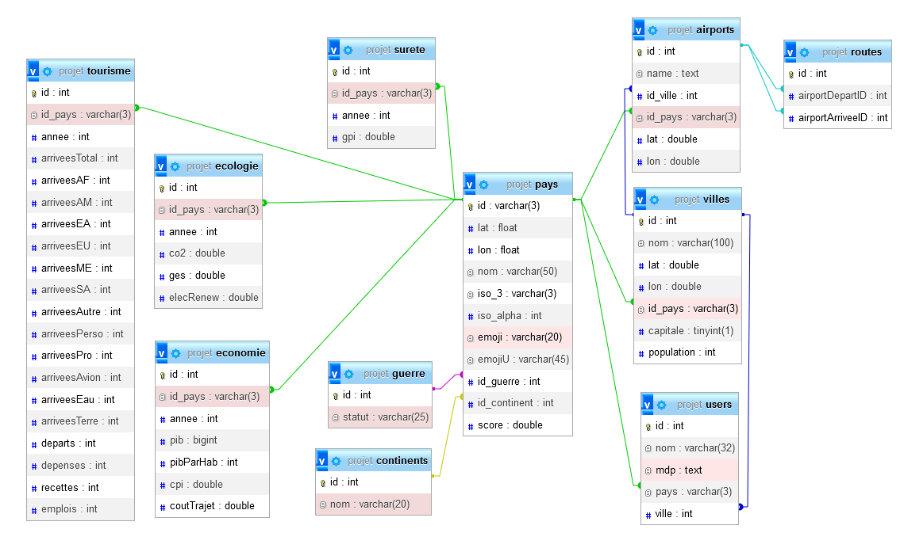

```{=tex}
\begin{center}
  \includegraphics[width=0.2\textwidth]{images/logo_university.jpg}
\end{center}
```
\vspace{2cm}

\thispagestyle{empty}

```{=tex}
\begin{center}
  \textcolor{blue}{\huge\bfseries Rapport de Base de données}
\end{center}
```
\vspace{2cm}

```{=tex}
\begin{center}
  \textbf{ \Large Ecotourisme : Une analyse statistique et prévisionnelle de l'aspect économique et écologique du tourisme}
\end{center}
```
\vspace{2cm}

\hrule

\vspace{2cm}

```{=tex}
\begin{tabularx}{\textwidth}{lX}
  {\large\textbf{Étudiants :}} & \\
  Cassandra Sénécaille & \textcolor{blue}{\texttt{cassandra.senecaille@etu.univ-montp3.fr}} \\
  Rémy Gilibert & \textcolor{blue}{\texttt{remy.gilibert@etu.univ-montp3.fr}} \\
  Lucas Triozon & \textcolor{blue}{\texttt{lucas.triozon@etu.univ-montp3.fr}} \\
  Aya Mohamedatni & \textcolor{blue}{\texttt{aya.mohamedatni@etu.univ-montp3.fr}} \\
  Hugo Gonçalves & \textcolor{blue}{\texttt{hugo.goncalves@etu.univ-montp3.fr}} \\
  Line Bransolle & \textcolor{blue}{\texttt{line.bransolle@etu.univ-montp3.fr}} \\
\end{tabularx}
```
\newpage

```{=tex}
\tableofcontents  
\newpage
```
```{=tex}
\pagestyle{fancy}
\fancyhf{}
\fancyhead[R]{Montpellier 3 - Université Paul Valéry}
\fancyhead[L]{\leftmark}
\fancyfoot[C]{\thepage}
```
\newpage

# 1. Introduction


Dans le cadre d'un projet nécessitant l'usage et la visualisation de données, le bon stockage de ces dernières est une étape primordiale dont repose la réussite du travail.
Cela comprend le choix des données, leur traitement, leur structuration jusqu'à enfin les requêtes qui sont effectuées dessus.
Il est nécessaire d'être méticuleux dans les définitions et les relations entre les tables, afin d'avoir une base de qualité et qui n'est pas confuse.

C'est une tâche d'autant plus complexe quand on traite d'un sujet multifacteur, et qui nécessite une quantité de données importantes : elles doivent concerner les plus de pays possible pour une analyse plus complète, sur une échelle de temps assez importante pour tirer des conclusions, et des statistiques différentes à mettre en perspective.

L'objectif principal était d'avoir des données liées à l'économie, au tourisme et à l'écologie.
Les limitations de chaque données se sont ensuite imposées à nous au fil de nos recherches.

# 2. Provenance des données

La complexité de notre sujet a fait que nous avons dû nous baser sur des données traitant de thèmes différents (tourisme, écologie et économie), et provenant donc de diverses sources.
Toutes sont en accès libre sur Internet, exploitables, et proviennent pour la majeure partie d'organismes que nous jugeons fiables.
La plupart sont en format csv, mais certaines sous forme de tableau Excel, plus une dernière source qui est déjà en SQL.
Cela a nécessité un traitement spécifique pour tout uniformiser, qui sera détaillé dans la partie suivante.

-   **Source de données 1 :**

    -   **Description :** Liste de tous les pays du monde avec informations générales.
    -   **Provenance :** Projet collaboratif très complet.
    -   **Format :** Fichier CSV.
    -   **Lien :** [\textcolor{blue}{Countries Database}](https://github.com/dr5hn/countries-states-cities-database/blob/master/csv/countries.csv)
    -   **Complément :** Noms de pays en français [Google Public Data](https://developers.google.com/public-data/docs/canonical/countries_csv?hl=fr)

-   **Source de données 2 :**

    -   **Description :** Statistiques sur le tourisme mondial : arrivées, départs, recettes et dépenses par pays.
    -   **Provenance :** Données de l'UNWTO : l'organisation mondiale du tourisme, branche des Nations Unies.
    -   **Format :** Fichier Excel comprenant 12 feuilles.
    -   **Lien :** [\textcolor{blue}{UNWTO Tourism Statistics}](https://www.unwto.org/tourism-statistics/key-tourism-statistics)

-   **Source de données 3**

    -   **Description :** Statistiques économiques : PIB et PIB/hab.

    -   **Provenance :** Données de la Banque Mondiale.

    -   **Format :** Fichier CSV.

    -   **Lien :** [\textcolor{blue}{World Bank GDP Statistics}](https://databank.worldbank.org/reports.aspx?source=2&series=NY.GDP.MKTP.CD)

-   **Source de données 4**

    -   **Description :** Statistiques économiques : prix de consommation.

    -   **Provenance :** Données des Nations Unies.

    -   **Format :** Fichier CSV.

    -   **Lien :** [\textcolor{blue}{UN Consumer Price Index}](https://data.un.org/_Docs/SYB/CSV/SYB66_128_202310_Consumer%20Price%20Index.csv)

-   **Source de données 5**

    -   **Description :** Statistiques écologiques : émissions de CO2 et de gaz à effet de serre par pays.

    -   **Provenance :** Données de la Banque Mondiale.

    -   **Format :** Fichiers Excel.

    -   **Liens :** [\textcolor{blue}{CO2 Emissions}](https://data.worldbank.org/indicator/EN.ATM.CO2E.KT) et [\textcolor{blue}{GHG Emissions}](https://data.worldbank.org/indicator/EN.ATM.GHGT.KT.CE)

-   **Source de données 6**

    -   **Description :** Statistiques écologiques : part d'énergie renouvelable produite par pays.

    -   **Provenance :** Données de Ember, think tank indépendant.

    -   **Format :** Fichier CSV.

    -   **Lien :** [\textcolor{blue}{Renewable Energy Share}](https://ourworldindata.org/grapher/share-electricity-renewables?time=1986)

-   **Source de données 7**

    -   **Description :** Statistiques diverses : Global Peace Index par pays.

    -   **Provenance :** Données par Institute for Economics and Peace.

    -   **Format :** Fichier CSV.

    -   **Liens :** [\textcolor{blue}{Vision of Humanity}](https://www.visionofhumanity.org/maps/#/) et [\textcolor{blue}{Wikipedia - Global Peace Index}](https://en.wikipedia.org/wiki/Global_Peace_Index)

-   **Source de données 8**

    -   **Description :** Statistiques diverses : liste des pays en conflit.

    -   **Provenance :** Table HTML.

    -   **Lien :** [\textcolor{blue}{Countries Currently at War}](https://wisevoter.com/country-rankings/countries-currently-at-war/)

-   **Source de données 9**

    -   **Description :** Liste mondiale de villes.

    -   **Provenance :** Fichier CSV.

    -   **Lien :** [\textcolor{blue}{World Cities}](https://simplemaps.com/data/world-cities)

-   **Source de données 10**

    -   **Description :** Liste mondiale d'aéroports et routes aériennes.

    -   **Provenance :** Projet collaboratif, données SQL.

    -   **Lien :** [\textcolor{blue}{OpenFlights}](https://github.com/jpatokal/openflights)

# 3. Traitements

## Généralités

Au vu de la quantité de sources que nous avons, réunir toutes les tables et données au sein d'une même structure a été un défi.
Par exemple, chaque fichier n'utilise pas forcément les mêmes identifiants pour définir un même pays : code ISO2, code ISO3 ou même le nom du pays directement.

ISO 3166-1 alpha-2 et ISO 3166-1 alpha-3 sont des normes internationales définissant respectivement des codes de deux et trois lettres pour la représentation normalisée des noms de pays.

De plus, une de nos sources de données est un fichier Excel formaté, où l'extraction manuelle est impossible.

Pour faire cela, nous avons écrit plusieurs scripts Python pour manipuler les fichiers Excel et CSV et injecter les données finales dans notre base.

-   **Source de données 1 :**

Nous avons filtré le document pour ne conserver que les colonnes intéressantes : noms, codes ISO, coordonnées géographiques, drapeaux, continent.
Cela constitue le socle de nos tables.

Les noms ont été traduits en français avec la source complémentaire.
Les pays entre notre source initiale et le complément ont été réunis par le code ISO2.
Cette source étant incomplète, certains noms ont dû être repris manuellement.

Par la suite, nous avons supprimé certains pays qui ne figuraient dans aucun de nos jeux de données statistiques (détaillé dans les difficultés).

-   **Source de données 2 :**

Le fichier Excel fourni par l'UNWTO est extrêmement formaté : chaque pays possède plusieurs lignes de stats, avec les années en colonnes, et un header contenant des informations sur plusieurs lignes.
Ce n'est absolument pas idéal pour traiter les informations, mais par chance un pattern ressort de ce fichier à travers chaque feuille, ce qui permet d'automatiser l'extraction facilement à l'aide de Python.

Ce traitement consiste à prendre les feuilles qui nous intéressent et à donner les intervalles de lignes entre les stats que l'on recherche, puis le programme génère un fichier CSV complet qui reproduit la feuille.
Ce CSV est ensuite retraité pour créer une nouvelle table, cette fois-ci en faisant passer les années dans les lignes.
Ce deuxième traitement permet aussi la fusion de plusieurs feuilles en mettant chaque statistique différente en colonnes.

Voici ces deux fonctions en Python :

```{python}

def baseCsv(nameXlsx, nameSheet, nameCsv, maxRow, pad, plus, head, start, stop, pays, 
checkIso=False, checkNA=False, xls=False):
    """Cette fonction traite un fichier xlsx pour le transvaser en un fichier CSV 
    lisible. 
    Il est nécessaire que le fichier soit formatté de telle sorte que chaque année
    soit en colonne, et chaque pays en ligne. Elle nécessite beaucoup de paramètres 
    à entrer à la main :
    - `nameXlsx`, `nameSheet`, `nameCsv` : nom du fichier XLSX, nom de la feuille, 
    et nom du CSV que l'on veut créer
    - `maxRow`, `pad`, `plus`, `head` : nombre de lignes dans le fichier, écart 
    entre chaque pays, écart entre le nom du pays et les données, nombre de lignes 
    d'en-tête à ignorer
    - `start` et `stop` : année de début et de fin des données
    - `pays` : nom de la colonne où est inséré le nom du pays
    - Paramètres optionnels : `checkIso` pour filtrer les pays / `checkNA` pour 
    retirer les valeurs nulles / `xls` si le fichier est un .xls au lieu de .xlxs
    Le fichier Excel doit se trouver dans le répertoire data/xlsx, et le CSV sera 
    sauvegardé dans data/csv"""

    with open(f"data/csv/{nameCsv}.csv", "w", encoding="UTF-8") as file:

        ext = "xls" if xls else "xlsx"
        df = pd.read_excel(f"data/xlsx/{nameXlsx}.{ext}", nameSheet, header=head)
        print(len(df))

        liste = [i for i in range(start, stop+1)]
        file.write("Pays;"+";".join(list(map(lambda x: str(x), liste)))+"\n")

        for row in range(0, maxRow, pad):
            string = str(df[pays][row])

            if checkIso and string not in isos:
                continue

            for col in liste:
                if not checkNA and df[col][row+plus] == "..":
                    string += ";NULL"
                elif checkNA and pd.isna(df[col][row+plus]):
                    string += ";NULL"
                else:
                    string += f";{df[col][row+plus]}"

            file.write(string+"\n")

    file.close()

```

```{python}
def agglomerate(tags,start,stop,maxRow):
    from copy import deepcopy

    allTable =[]
    for i in tags:
        allTable.append(deepcopy(readCSV(i)))

    final = []

    for i in range(start,stop+1):
        for j in range(maxRow):
            dictA = {"Pays":allTable[0][j]["Pays"],"Annee":i}
            for z, t in enumerate(allTable):
                dictA[tags[z]] = t[j][str(i)]
            final.append(dictA.copy())
    
    return final
```

Nous avons conservé les statistiques (depuis la feuille) : arrivées touristiques totales (Indound Tourism-Arivals), arrivées depuis chaque région du monde (Inbound Tourism-Regions), arrivées pour raisons personnelles et professionnelles (Inbound Tourism-Purpose), départs touristiques totaux (Outbound Tourism-Departures), dépenses touristiques (Outbound Tourism-Expenditure), recettes touristiques (Inbound Tourism-Expenditure), moyen d'arrivée dans le pays (Indound Tourism-Transport) et enfin les emplois liés au tourisme (Employment)

Certains pays ont été supprimés, car ils ne figuraient pas dans notre liste de pays ou parce qu'ils ne présentaient pas assez de données.

Les noms des pays ont dû être remplacés par leur codes ISO2, afin de coller à la table principale

-   **Source de données 3 :**

Suppression des données qui ne sont pas datées entre 1995 et 2021.

Remplacement des noms de pays par leur code ISO2.

-   **Source de données 4 :**

Conservation des données qui sont sous l'intitulé "Consumer price index: General"

Remplacement des codes numériques des pays par leur code ISO2.

-   **Source de données 5 :**

De la même manière que la source de donnée 1, nous avons deux tableaux Excel avec chaque pays en ligne et les années en colonne, mais moins formaté, et ne présentant qu'une statistique par pays.
Notre script python étant flexible, le processus de traitement pour rendre les données exploitables a été le même.

Suppression des données qui ne sont pas datées entre 1990 et 2020.

Remplacement des codes ISO3 des pays par leur code ISO2.

-   **Source de données 6 :**

Remplacement des codes ISO3 des pays par leur code ISO2.

-   **Source de données 7 :**

Traitement identique à la source de données 5.
Feuille choisie : Overall Scores.

Remplacement des codes ISO3 des pays par leur code ISO2.

-   **Source de données 8 :**

La source ne fournit pas directement de fichier, mais seulement une table produite en HTML.
Nous avons copié collé cette table dans un fichier CSV, puis traduit les pays et types de conflits auxquels ils sont confrontés.

-   **Source de données 9 :**

Tri des colonnes pour conserver le nom des villes (city), la latitude (lat), la longitude (lng), le code du pays (ISO2), si la ville est une capitale (capital), et la population de la ville (population).

Transformation de la colonne capital pour avoir des valeurs booléennes si la ville est une capitale ou non à la place de la valeur 'primary'.

Traitement des villes, pour faire le tri et ne garder que quelques villes par pays.

On garde la ou les capitales, puis entre 5 et 20 villes connues ou les plus peuplées par pays.

Simplification des caractères spéciaux pour les villes, pour éviter les erreurs de syntaxe.

Remplacement des virgules par des points pour les longitudes et latitudes.

-   **Source de données 10 :**

Cette source est déjà sous format SQL.
Elle a été importée en dernier, une fois que notre base était bien constituée.
Nous avons importé les deux tables qui nous intéressaient pour notre base, les aéroports et les routes aériennes, puis les avons traitées par des requêtes SQL.

Filtrage des colonnes : id, noms et lieux des aéroports et aéroports d'arrivée et de départ des routes.

Remplacement des noms de pays par leur code ISO2 et remplacement des noms de villes par leur ID dans notre base.

Tri des aéroports pour ne garder que ceux des villes venant de la source de données 9, stockées dans une table nommée villes.

```{SQL}
DELETE FROM airports 
WHERE CONCAT(city,id_pays) 
NOT IN (SELECT CONCAT(nom,id_pays) FROM villes);
```

Par conséquent, suppression de toutes les routes aériennes ayant pour aéroport d'arrivée ou de départ un aéroport qui a été supprimé.

```{SQL}
DELETE FROM routes 
WHERE dst_apid 
NOT IN (SELECT apid FROM airports) OR src_apid 
NOT IN (SELECT apid FROM airports); 
```

# 4. Descriptif des tables

Une fois les données traitées, il faut les rendre prêtes à l'usage en choisissant la meilleure structure de stockage au sein de notre base de données.
Voici le descriptif des tables créées.

## Synthèse

| Nom        | Colonnes | Lignes | Clés étrangères   | N° source |
|------------|----------|--------|-------------------|-----------|
| pays       | 10       | 195    | continent, guerre | 1, 8      |
| tourisme   | 20       | 4780   | pays              | 2         |
| economie   | 7        | 5465   | pays              | 3, 4      |
| ecologie   | 6        | 6014   | pays              | 5, 6      |
| surete     | 4        | 2432   | pays              | 7         |
| villes     | 7        | 2277   | pays              | 9         |
| guerre     | 2        | 6      | /                 | 8         |
| continents | 2        | 6      | /                 | /         |
| airports   | 6        | 1260   | pays, ville       | 10        |
| routes     | 3        | 20556  | airports          | 10        |
| users      | 5        | N/A    | pays, ville       | /         |

## Description individuelle

-   **pays : données de la source 1, 195 lignes, 10 colonnes**

| Champ        | Type    | Description                                                         |
|------------------------|------------------------|------------------------|
| id           | VARCHAR | Clé primaire, code de chaque pays. Suit la norme ISO 3166-1 alpha-2 |
| lat          | DOUBLE  | Latitude géographique du pays                                       |
| lon          | DOUBLE  | Longitude géographique du pays                                      |
| nom          | VARCHAR | Nom complet du pays                                                 |
| iso_3        | VARCHAR | Code ISO 3166-1 alpha-3 du pays                                     |
| iso_alpha    | INT     | Code ISO 3166-1 numérique du pays                                   |
| emoji        | VARCHAR | Emoji drapeau associé au pays                                       |
| emojiU       | VARCHAR | Emoji drapeau associé au pays en caractères Unicode                 |
| id_guerre    | INT     | ID du statut de guerre du pays, clé étrangère de guerre             |
| id_continent | INT     | ID du continent du pays, clé étrangère de continents                |

-   **tourisme : données de la source 2, 4780 lignes, 20 colonnes**

| Champ         | Type    | Description                                                                               |
|------------------------|------------------------|------------------------|
| id            | INT     | Clé primaire, id numérique de la ligne.                                                   |
| id_pays       | VARCHAR | Code du pays concerné par la ligne, clé étrangère de pays                                 |
| annee         | INT     | Date des données                                                                          |
| arriveesTotal | INT     | Nombre total d'arrivées dans le pays sur l'année, en milliers                             |
| arriveesAF    | INT     | Nombre d'arrivées dans le pays venant d'Afrique sur l'année, en milliers                  |
| arriveesAM    | INT     | Nombre d'arrivées dans le pays venant d'Amérique sur l'année, en milliers                 |
| arriveesEA    | INT     | Nombre d'arrivées dans le pays venant d'Asie de l'Est sur l'année, en milliers            |
| arriveesEU    | INT     | Nombre d'arrivées dans le pays venant d'Europe sur l'année, en milliers                   |
| arriveesME    | INT     | Nombre d'arrivées dans le pays venant du Moyen Orient sur l'année, en milliers            |
| arriveesSA    | INT     | Nombre d'arrivées dans le pays venant d'Asie du Sud sur l'année, en milliers              |
| arriveesAutre | INT     | Nombre d'arrivées dans le pays venant d'ailleurs (non classifié) sur l'année, en milliers |
| arriveesPerso | INT     | Nombre d'arrivées dans le pays pour des raisons personnelles sur l'année, en milliers     |
| arriveesPro   | INT     | Nombre d'arrivées dans le pays pour des raisons professionnelles sur l'année, en milliers |
| arriveesAvion | INT     | Nombre d'arrivées dans le pays par voie aérienne sur l'année, en milliers                 |
| arriveesEau   | INT     | Nombre d'arrivées dans le pays par voie maritime sur l'année, en milliers                 |
| arriveesTerre | INT     | Nombre d'arrivées dans le pays par voie terrestre sur l'année, en milliers                |
| departs       | INT     | Nombre total de départs depuis le pays sur l'année, en milliers                           |
| depenses      | INT     | Argent dépensé lors des voyages de personnes parties du pays, en millions de US\$         |
| recettes      | INT     | Argent récolté lors des voyages de personnes venant dans le pays, en millions de US\$     |
| emploi        | INT     | Nombre d'emplois généré par le tourisme                                                   |

-   **economie : données des sources 3 et 4, 5465 lignes, 7 colonnes**

| Champ     | Type    | Description                                               |
|------------------------|------------------------|------------------------|
| id        | INT     | Clé primaire, id numérique de la ligne.                   |
| id_pays   | VARCHAR | Code du pays concerné par la ligne, clé étrangère de pays |
| annee     | INT     | Date des données                                          |
| cpi       | INT     | Indice des prix de consommation, en US\$                  |
| pib       | BIGINT  | Produit intérieur brut en US\$                            |
| pibParHab | BIGINT  | Produit intérieur brut par habitant en US\$               |

-   **ecologie : données des sources 5 et 6, 6014 lignes, 6 colonnes**

| Champ     | Type    | Description                                                     |
|------------------------|------------------------|------------------------|
| id        | INT     | Clé primaire, id numérique de la ligne.                         |
| id_pays   | VARCHAR | Code du pays concerné par la ligne, clé étrangère de pays       |
| annee     | INT     | Date des données                                                |
| co2       | DOUBLE  | Émissions de CO2 du pays                                        |
| ges       | DOUBLE  | Émissions de gaz à effet de serre du pays                       |
| elecRenew | DOUBLE  | \% d'électricité renouvelable produite dans le pays (1990-2015) |

-   **surete : données de la source 7, 2432 lignes, 4 colonnes**

| Champ   | Type    | Description                                               |
|------------------------|------------------------|------------------------|
| id      | INT     | Clé primaire, id numérique de la ligne.                   |
| id_pays | VARCHAR | Code du pays concerné par la ligne, clé étrangère de pays |
| annee   | INT     | Date des données                                          |
| cpi     | INT     | Indice de paix                                            |

-   **villes : données de la source 9, 2277 lignes, 7 colonnes**

| Champ      | Type    | Description                                               |
|------------------------|------------------------|------------------------|
| id         | INT     | Clé primaire, id numérique de la ligne.                   |
| nom        | VARCHAR | Nom de la ville                                           |
| lat        | DOUBLE  | Latitude géographique de la ville                         |
| lon        | DOUBLE  | Longitude géographique de la ville                        |
| id_pays    | VARCHAR | Code du pays concerné par la ligne, clé étrangère de pays |
| capitale   | BOOLEAN | Vrai si la ville est une capitale                         |
| population | INT     | Nombre d'habitant dans la ville                           |

-   **guerre : données de la source 8, 6 lignes, 2 colonnes**

| Champ  | Type    | Description                             |
|--------|---------|-----------------------------------------|
| id     | INT     | Clé primaire, id numérique de la ligne. |
| statut | VARCHAR | Intitulé du statut                      |

-   **continents : 6 lignes, 2 colonnes**

| Champ | Type    | Description                             |
|-------|---------|-----------------------------------------|
| id    | INT     | Clé primaire, id numérique de la ligne. |
| nom   | VARCHAR | Nom du continent                        |

-   **airports : données de la source 10, 1260 lignes, 6 colonnes**

| Champ    | Type    | Description                                                     |
|------------------------|------------------------|------------------------|
| id       | INT     | Clé primaire, id numérique de l'aéroport.                       |
| nom      | VARCHAR | Nom de l'aéroport                                               |
| id_ville | INT     | ID de la ville où se trouve l'aéroport, clé étrangère de villes |
| id_pays  | VARCHAR | ID du pays où se trouve l'aéroport, clé étrangère de pays       |
| lat      | DOUBLE  | Latitude géographique de la ville                               |
| lon      | DOUBLE  | Longitude géographique de la ville                              |

-   **routes : données de la source 10, 20556 lignes, 3 colonnes**

| Champ            | Type | Description                                                       |
|------------------------|------------------------|------------------------|
| id               | INT  | Clé primaire, id numérique de la route aérienne.                  |
| airportDepartID  | INT  | ID de l'aéroport de départ de la route, clé étrangère de airports |
| airportArriveeID | INT  | ID de l'aéroport d'arrivée de la route, clé étrangère de airports |

-   **users : table qui gère les utilisateurs de notre site, 5 colonnes**

| Champ    | Type    | Description                                                           |
|------------------------|------------------------|------------------------|
| id       | INT     | Clé primaire, id numérique de l'utilisateur                           |
| nom      | VARCHAR | Nom de l'utilisateur                                                  |
| id_ville | INT     | ID de la ville de résidence de l'utilisateur, clé étrangère de villes |
| id_pays  | VARCHAR | ID du pays de résidence de l'utilisateur, clé étrangère de pays       |
| mdp      | TEXT    | Mot de passe hashé de l'utilisateur                                   |

\newpage

# 5. MCD / MOD

## MCD

{width="80%" height="60%"}

\newpage

## MOD

{width="80%" height="60%"}

\newpage

# 6. Difficultés

Comme évoqué plus tôt dans le rapport, les difficultés principales lors de la création de notre base de données ont été de trouver les données adéquates provenant de sources sûres et de les associer.
Mais ce ne sont pas les seuls.

Une fois toutes nos données importées dans nos tables, nous avons fait face à un problème : chaque table ne contient pas les mêmes pays.
Il faut savoir que l'ONU reconnaît officiellement 197 États dans le monde.
Mais tous ne partagent pas leurs statistiques internes, ajoutées au fait que nos sources sont toutes différentes, et que certaines donnent une importance à des états semi-autonomes, il y a des disparités.
Un tri doit être fait !

Pour cela nous avons choisi une approche globale, et de regarder quels pays étaient présents dans chaque table.
Nous avons créé une table complémentaire, nommée checking :

-   **checking : 249 lignes, 7 colonnes**

| Champ    | Type    | Description                                        |
|----------|---------|----------------------------------------------------|
| id       | VARCHAR | Clé primaire, id du pays.                          |
| pays     | BOOLEAN | Vrai si le pays est présent dans la table pays     |
| tourisme | BOOLEAN | Vrai si le pays est présent dans la table tourisme |
| economie | BOOLEAN | Vrai si le pays est présent dans la table economie |
| ecologie | BOOLEAN | Vrai si le pays est présent dans la table ecologie |
| surete   | BOOLEAN | Vrai si le pays est présent dans la table surete   |
| villes   | BOOLEAN | Vrai si le pays est présent dans la table villes   |

Cette table est alimentée par un script Python, qui va regarder pour chacun des 249 pays listés dans notre carte intéractive s'il a au moins une occurrence dans les tables de statistiques.

```{Python}

def checking():
    global db
    cnx, cur = connectSQL(db)
    cur.execute("DROP TABLE IF EXISTS checking;")

    pays = ["AD","AE","AF","AG","AI","AL","AM","AO","AQ","AR","AS","AT","AU","AW",
            "AX","AZ","BA","BB","BD","BE","BF","BG","BH","BI","BJ","BL","BM","BN",
            "BO","BQ","BR","BS","BT","BV","BW","BY","BZ","CA","CC","CD","CF","CG",
            "CH","CI","CK","CL","CM","CN","CO","CR","CU","CV","CW","CX","CY","CZ",
            "DE","DJ","DK","DM","DO","DZ","EC","EE","EG","EH","ER","ES","ET","FI",
            "FJ","FK","FM","FO","FR","GA","GB","GD","GE","GF","GG","GH","GI","GL",
            "GM","GN","GP","GQ","GR","GS","GT","GU","GW","GY","HK","HM","HN","HR",
            "HT","HU","ID","IE","IL","IM","IN","IO","IQ","IR","IS","IT","JE","JM",
            "JO","JP","KE","KG","KH","KI","KM","KN","KP","KR","KW","KY","KZ","LA",
            "LB","LC","LI","LK","LR","LS","LT","LU","LV","LY","MA","MC","MD","ME",
            "MF","MG","MH","MK","ML","MM","MN","MO","MP","MQ","MR","MS","MT","MU",
            "MV","MW","MX","MY","MZ","NA","NC","NE","NF","NG","NI","NL","NO","NP",
            "NR","NU","NZ","OM","PA","PE","PF","PG","PH","PK","PL","PM","PN","PR",
            "PS","PT","PW","PY","QA","RE","RO","RS","RU","RW","SA","SB","SC","SD",
            "SE","SG","SH","SI","SJ","SK","SL","SM","SN","SO","SR","SS","ST","SV",
            "SX","SY","SZ","TC","TD","TF","TG","TH","TJ","TK","TL","TM","TN","TO",
            "TR","TT","TV","TW","TZ","UA","UG","UM","US","UY","UZ","VA","VC","VE",
            "VG","VI","VN","VU","WF","WS","YE","YT","ZA","ZM","ZW"] 
    # pays listés sur AMCharts

    liste = []
    for i in pays:
        a = {"Code":i}
        
        if cur.execute(f"SELECT DISTINCT id FROM pays WHERE id = '{i}'").fetchone() != None:
            a["pays"] = True
        else:
            a["pays"] = False

        for j in ["tourisme","economie","ecologie","surete","villes"]:
            if cur.execute(f"SELECT DISTINCT id_pays FROM {j}" 
                           f"WHERE id_pays = '{i}'").fetchone() != None:
                a[j] = True
            else:
                a[j] = False
        liste.append(a.copy())
    cur.execute("""
        CREATE TABLE IF NOT EXISTS checking (
            id VARCHAR(3) PRIMARY KEY,
            pays BOOLEAN,
            tourisme BOOLEAN,
            economie BOOLEAN,
            ecologie BOOLEAN,
            surete BOOLEAN,
            villes BOOLEAN
        )
    """)
    for i in liste:
        cur.execute(f"""
    INSERT INTO checking VALUES (
        '{i['Code']}',
        {i['pays']},
        {i['tourisme']},
        {i['economie']},
        {i['ecologie']},
        {i['surete']},
        {i['villes']}
    )
""")

    
    cnx.commit()
    
```

La lecture de cette table nous a permis de retirer 54 pays, qui n'étaient pas présents dans au moins une de ces tables : pays, tourisme, economie, ecologie.
Nous n'avons pas considéré surete car c'est une statistique complémentaire, qui n'est pas au coeur de notre sujet.
Pareil pour villes, qui est un bonus pour notre carte.
Cet autre script Python permet de supprimer de toutes nos tables de stats de pays donnés manuellement dans une liste :

```{Python}
def clearTables(liste):
    global db
    cnx, cur = connectSQL(db)

    tables = ["tourisme","surete","economie","ecologie","villes"]
    for i in liste:
        for j in tables:
            cur.execute(f"DELETE FROM {j} WHERE id_pays = '{i}'")
        cur.execute(f"DELETE FROM pays WHERE id = '{i}'")
    cnx.commit()
    
```

# 7. Conclusion

Au moment où nous rédigeons cette partie de rapport, le mercredi 15 novembre, la base de données n'est pas encore finalisée.
Des finitions restent à réaliser, possiblement dans le tri des pays par exemple, ou même ajouter des statistiques qui nous manqueraient.

Sa création n'a pas été simple, mais permet déjà de donner un aperçu de la structure qu'aura notre site, et de ce qu'il proposera.

Trouver des données fiables et savoir les exploiter est une étape très importante du travail, qui conditionne toute la suite du projet.

Nous nous retrouvons donc avec 11 tables différentes, connectées entre elles par des clés étrangères.
Elles gravitent principalement autour de la table pays, et proviennent de sources diverses et complémentaires : ONU, Banque Mondiale, deux projets collaboratifs, etc... Au vue de la quantité de données, le traitement automatisé par Python et SQL nous a permis de gagner un temps incalculable, car les manœuvres manuelles pour filtrer et modifier les données ont été assez faibles.

La critique que l'on pourrait tout de même adresser à ces méthodes est la nécessité d'avoir un ordinateur (très) puissant pour effectuer les opérations en temps rapide, et sans risque de Timeout Error.

Chaque membre du projet sans exception a été impliqué dans le processus de création de la base de données.
Elle a surtout été vérifiée et validée plusieurs fois avant chaque publication sur GitHub.
